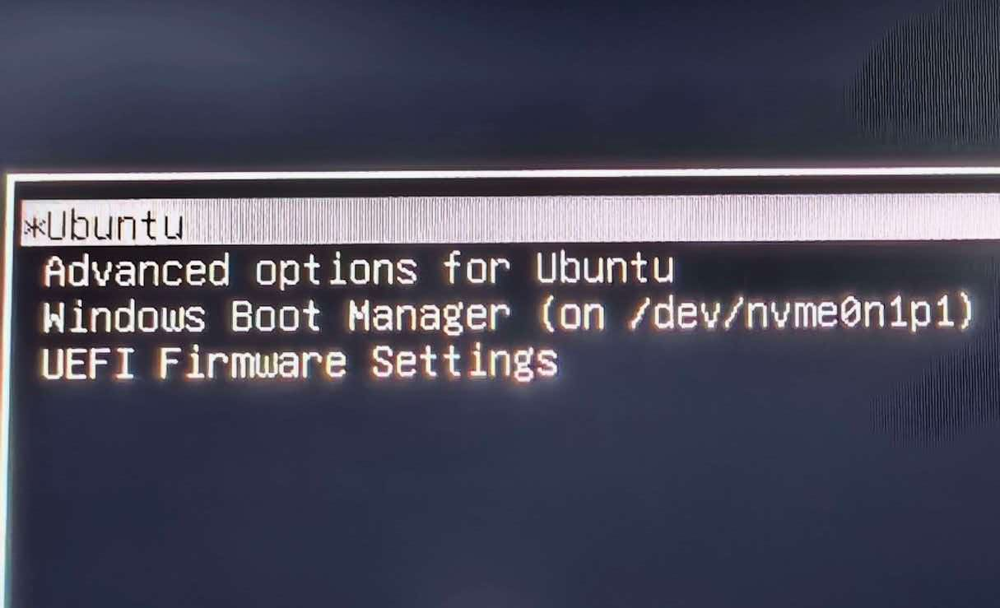
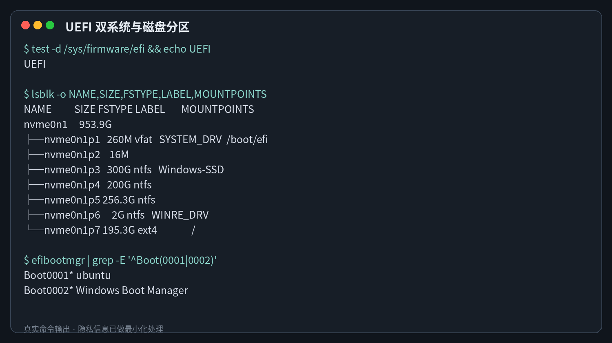
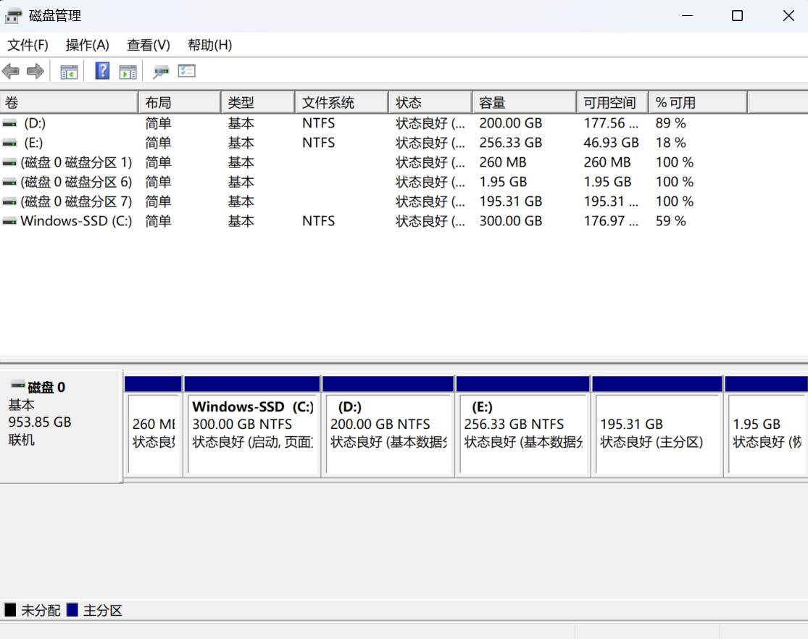
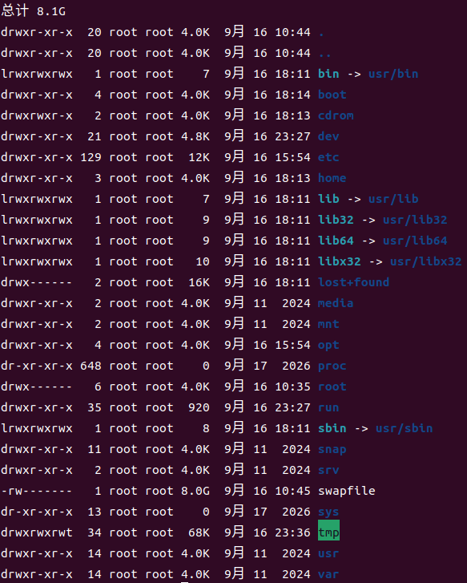
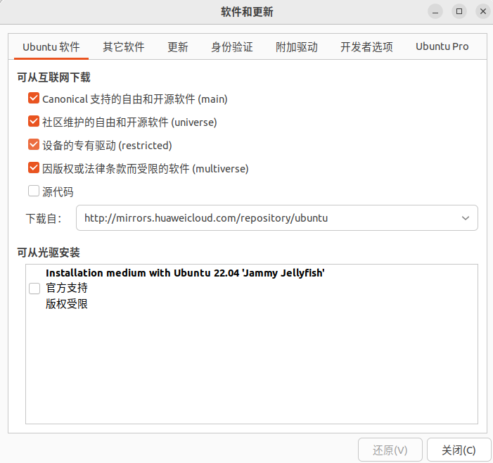
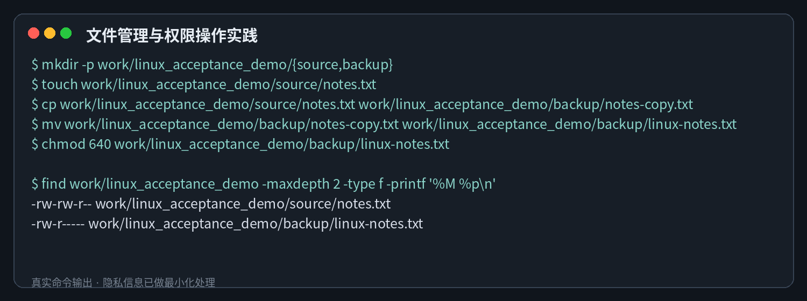
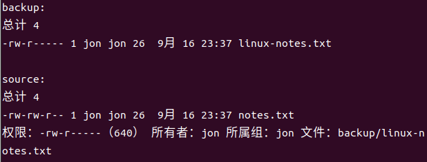
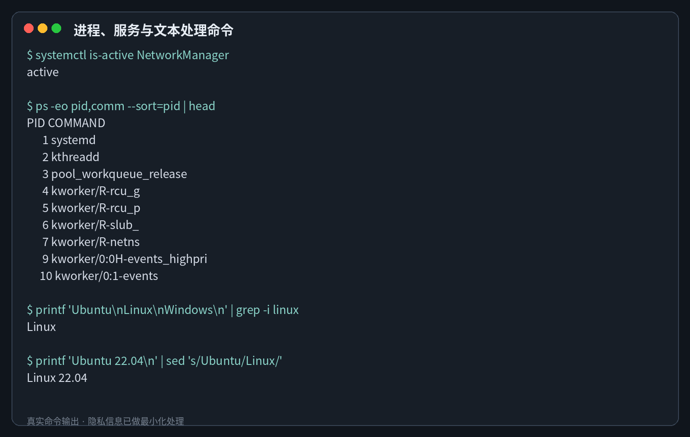

# Ubuntu 22.04 双系统安装、配置与 Linux 基础学习记录

## 一、学习目标

本阶段的目标是安装 Ubuntu 22.04，并学习 Linux 操作系统的基本使用方法。

主要目标包括：

1. 理解 UEFI、EFI 系统分区和双系统启动。
2. 能够检查系统版本、内核、磁盘分区和剩余空间。
3. 掌握文件、目录、权限、进程和服务管理命令。
4. 理解 Linux 目录结构和“一切皆文件”的哲学。

## 二、安装并认识环境

### 2.1 使用启动 U 盘安装 Ubuntu 22.04 双系统

本机当前运行 Ubuntu 22.04.5 LTS，系统代号为 Jammy，内核版本为 `6.8.0-40-generic`。

通过系统命令可以确认操作系统版本、内核、架构和设备型号。当前系统以 UEFI 模式启动，而不是传统的 Legacy BIOS 模式。

启动：

启动 U 盘制作参考：[Ubuntu 双系统安装教程 P4](https://www.bilibili.com/video/BV1Cc41127B9/?p=4)

#### 2.1.1 安装前的准备

为降低双系统安装过程中出现数据丢失、硬盘无法识别或驱动异常等风险，我在安装前完成了以下准备：

1. 备份 Windows 中的重要文件，并保存 BitLocker 恢复密钥。
2. 暂停 BitLocker 保护，避免调整分区或引导后触发恢复验证。

学习资料：[Ubuntu 双系统安装教程 P5](https://www.bilibili.com/video/BV1Cc41127B9/?p=5)

3. 确认 Windows 使用 UEFI 启动模式。
4. 检查 Secure Boot 设置。如果后续安装 NVIDIA 驱动时遇到内核模块签名问题，可以临时关闭 Secure Boot。

学习资料：[Ubuntu 双系统安装教程 P8](https://www.bilibili.com/video/BV1Cc41127B9/?p=8)

5. 检查磁盘控制器模式。如果 Ubuntu 安装程序无法识别硬盘，需要按照安全流程将 Intel RST 切换为 AHCI。

学习资料：[Ubuntu 双系统安装教程 P9](https://www.bilibili.com/video/BV1Cc41127B9/?p=9)

6. 如果安装过程中出现黑屏或显卡兼容问题，可以临时调整独显直连模式。

学习资料：[Ubuntu 双系统安装教程 P6](https://www.bilibili.com/video/BV1Cc41127B9/?p=6)

Secure Boot 和独显直连并不是安装 Ubuntu 时必须关闭的功能，是否调整应以实际兼容情况为准。Intel RST 不能直接随意切换，否则可能导致 Windows 无法正常启动。

#### 2.1.2 Windows 与 Ubuntu 分区方案

本机原有 Windows 系统。安装 Ubuntu 时保留 Windows 分区，并从磁盘空闲空间中划分一个独立的 ext4 分区给 Ubuntu。Windows 与 Ubuntu 共用 EFI 系统分区，但各自保留独立的启动文件。

+ `nvme0n1p1`：260 MB，FAT32，EFI 系统分区，挂载到 `/boot/efi`。
+ `nvme0n1p3`：300 GB，NTFS，Windows 系统分区。
+ `nvme0n1p4`、`nvme0n1p5`：Windows 数据分区。
+ `nvme0n1p6`：Windows 恢复分区。
+ `nvme0n1p7`：195.3 GB，ext4，Ubuntu 根分区，挂载到 `/`。

安装时最需要注意的是：已有的 EFI 分区只能复用，不能格式化，否则可能破坏 Windows Boot Manager。Ubuntu 根分区使用 ext4 文件系统，并挂载到 `/`。



检查结果中同时存在 `ubuntu` 和 `Windows Boot Manager` 两个 EFI 启动项，说明 Ubuntu 和 Windows 的启动文件均正常存在。

目前 Ubuntu 根分区可用空间约为 159 GB，使用率约为 13%；EFI 分区可用空间约为 204 MB，能够满足后续安装开发工具的需求。



分区参考：

1. [Ubuntu 双系统安装教程 P7](https://www.bilibili.com/video/BV1Cc41127B9/?p=7)
2. [Ubuntu 双系统安装教程 P21](https://www.bilibili.com/video/BV1Cc41127B9/?p=21)

### 2.2 了解 Linux 目录结构

Linux 从根目录 `/` 开始形成统一的目录树，不使用 Windows 式的盘符。常见目录包括：

+ `/home`：存放普通用户的个人文件。
+ `/etc`：存放系统和软件的配置文件。
+ `/var`：存放日志、缓存等经常发生变化的数据。
+ `/usr`：存放大部分用户程序和共享资源。
+ `/boot`：存放内核和系统启动相关文件。
+ `/dev`：存放硬件设备对应的设备文件。
+ `/proc`、`/sys`：用于展示内核、进程和硬件状态的虚拟文件系统。

“一切皆文件”是 Linux 的重要设计思想。普通文件、硬件设备和部分内核状态都可以通过类似文件的接口读取和处理，这使许多系统操作能够采用统一的方式完成。

绝对路径从根目录 `/` 开始，不依赖当前工作目录；相对路径则以当前工作目录为参照，会随着当前位置变化。



## 三、系统基础配置

### 3.1 软件源

当前 Ubuntu 已配置华为云镜像源。国内镜像通常可以提高软件包索引更新和软件下载的稳定性。

APT 常用命令如下：

```bash
sudo apt update
sudo apt upgrade
apt search <关键词>
sudo apt install <软件包名称>
```

其中：

1. `apt update` 只更新可用软件及其版本信息的索引，不会直接升级已经安装的软件；
2. `apt upgrade` 会根据最新的软件包索引升级已经安装的软件；
3. 遇到“找不到软件包”时，应先检查网络连接、软件源配置和软件包索引。

学习资料：[Ubuntu 双系统安装教程 P17](https://www.bilibili.com/video/BV1Cc41127B9/?p=17)



### 3.2 网络、时间与服务

经检查，NetworkManager、DNS 和时间同步均正常。使用 `systemctl --failed` 检查后，没有发现启动失败的系统服务。

```bash
systemctl status NetworkManager
systemctl is-active NetworkManager
systemctl --failed
```

本机是 Windows 与 Linux 双系统，硬件时钟目前使用本地时间，以避免两个系统之间出现明显时差。双系统环境中最重要的是让 Windows 和 Linux 采用一致的硬件时钟策略。

学习资料：

1. [Ubuntu 双系统安装教程 P16](https://www.bilibili.com/video/BV1Cc41127B9/?p=16)
2. [Ubuntu 双系统安装教程 P18](https://www.bilibili.com/video/BV1Cc41127B9/?p=18)

## 四、Linux 基础命令学习

### 4.1 文件与目录管理

| 命令 | 作用 |
| --- | --- |
| `pwd` | 显示当前工作目录 |
| `ls -lah` | 查看文件、权限及隐藏文件 |
| `mkdir -p` | 创建目录及缺失的父目录 |
| `touch` | 创建空文件或更新时间戳 |
| `cp` | 复制文件或目录 |
| `mv` | 移动文件或重命名文件 |
| `rm` | 删除文件，使用递归参数时需要谨慎 |
| `find` | 按指定条件查找文件 |


在实际练习中，我创建了 `source` 和 `backup` 两个目录，将文件复制到备份目录后进行重命名，并修改了文件权限。





最终权限 `-rw-r-----` 对应 `chmod 640`：文件所有者可以读取和写入，同组用户只能读取，其他用户没有访问权限。其中数字 6 是 4（读取）与 2（写入）之和。

### 4.2 进程、服务和文本处理

+ `ps`、`top`：查看系统进程和资源使用情况。
+ `kill`：向指定进程发送信号。
+ `systemctl`：查看或管理 systemd 服务。
+ `grep`：搜索符合条件的文本。
+ `sed`：进行流式文本替换和编辑。
+ `awk`：按列处理结构化文本。



命令行工具的优势不仅体现在操作速度上，更重要的是可以使用管道符 `|` 将多个命令组合起来。一个命令产生的输出可以继续交给 `grep`、`sed` 或 `awk` 进行筛选和处理，从而将重复操作整理为可以复用的命令或脚本。

## 五、总结

本阶段完成了 Ubuntu 22.04 双系统的安装和基本检查，并开始理解 Linux 与 Windows 在启动方式、目录结构、文件权限和软件管理方面的差异。过去我更依赖图形界面，现在已经可以使用命令快速确认系统状态，并根据权限字符串判断文件的访问范围。

我认为学习 Linux 最重要的不是死记命令参数，而是形成解决问题的基本顺序：先观察现象，收集版本、日志和运行状态，再提出可能的原因并逐项验证。例如软件无法运行时，应先检查命令是否存在、依赖是否安装、权限是否正确、相关服务是否启动，而不是直接重装系统。
