学习资料：[ROS2 Tuition 第四章](https://rzl6.github.io/ROS2_Tuition/di-4-zhang-ros2-gong-ju-zhi-launch-rosbag2-yu-rqt.html)  
实践环境：Ubuntu 22.04.5 LTS + ROS 2 Humble  
工作空间：`~/ws02`  
功能包：`cpp01_launch`、`cpp02_rosbag`

# 一、学习目标
本阶段主要学习 ROS 2 的 Launch 启动系统与 rosbag2 数据工具。Launch 用来集中启动、配置和管理多个节点；rosbag2 用来录制、检查和回放话题数据，便于调试、复现问题和进行离线测试。

1. 理解 Launch 的使用场景和基本结构；
2. 掌握节点、参数、命令、包含、分组和事件配置；
3. 能够使用 Python、XML、YAML 三种格式编写 Launch 文件；
4. 掌握 rosbag2 的命令行录制、查看和回放流程；
5. 能够使用 C++ 编写简单的 rosbag2 录制与读取程序。

# 二、Launch 基础与工作空间
## 2.1 Launch 的作用
机器人项目通常要同时启动驱动、发布者、订阅者、服务端和可视化节点。逐个执行 `ros2 run` 容易遗漏参数，Launch 可以统一设置节点名称、命名空间、参数文件、话题重映射、进程命令和事件关系。

## 2.2 本机目录结构
~/ws02/src/cpp01_launch/ ├── CMakeLists.txt ├── package.xml ├── config/ │   └── t2.yaml └── launch/     ├── py01_helloworld_launch.py ... py07_event_launch.py     ├── xml01_helloworld_launch.xml ... xml06_group_launch.xml     └── yaml01_helloworld_launch.yaml ... yaml06_group_launch.yaml

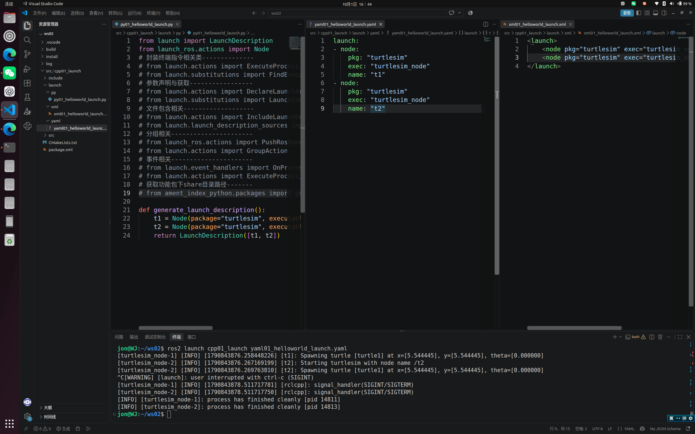

_图：Python、XML、YAML 三种 Launch 文件及运行检查_

## 2.3 安装、编译与运行
`CMakeLists.txt` 需要把 `launch` 和 `config` 安装到功能包共享目录：

install(DIRECTORY launch config   DESTINATION share/${PROJECT_NAME} )cd ~/ws02 colcon build --packages-select cpp01_launch source install/setup.bash ros2 launch cpp01_launch py01_helloworld_launch.py

本机已经在 `~/.bashrc` 中加载 ROS 2、`ws01` 和 `ws02` 环境。新终端通常不需要再次手动执行 `source`，但修改 Launch 文件后仍需重新编译。

**参考：**

1. [ROS2 工具之 Launch 文件与 rosbag2——引言](https://www.bilibili.com/video/BV15V4y1P744/?p=1)
2. [Launch 文件应用场景、概念、作用与准备工作](https://www.bilibili.com/video/BV15V4y1P744/?p=2)
3. [Launch 基本使用流程——C++ 实现](https://www.bilibili.com/video/BV15V4y1P744/?p=3)
4. [Launch 基本使用流程——Python 实现](https://www.bilibili.com/video/BV15V4y1P744/?p=4)

# 三、Python Launch
## 3.1 基本结构与节点启动
Python Launch 文件通过 `generate_launch_description()` 返回 `LaunchDescription`。本机的 `py01_helloworld_launch.py` 同时启动两个 turtlesim 节点；`py02_node_launch.py` 继续练习节点名称、命名空间、参数和自动重启。

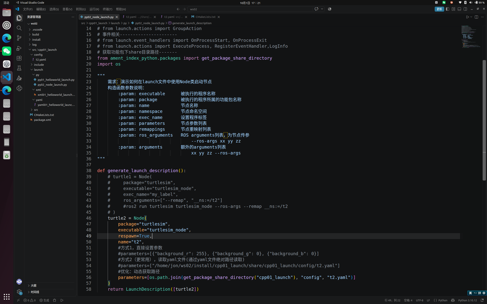

_图：Python Launch 节点配置练习_

## 3.2 参数文件与节点完整名称
`py02_node_launch.py` 使用 `get_package_share_directory()` 查找安装后的 `config/t2.yaml`。YAML 顶层键必须与节点完整名称一致：节点名为 `t2`、命名空间为 `ns` 时，应写成 `/ns/t2`，否则参数不会加载。

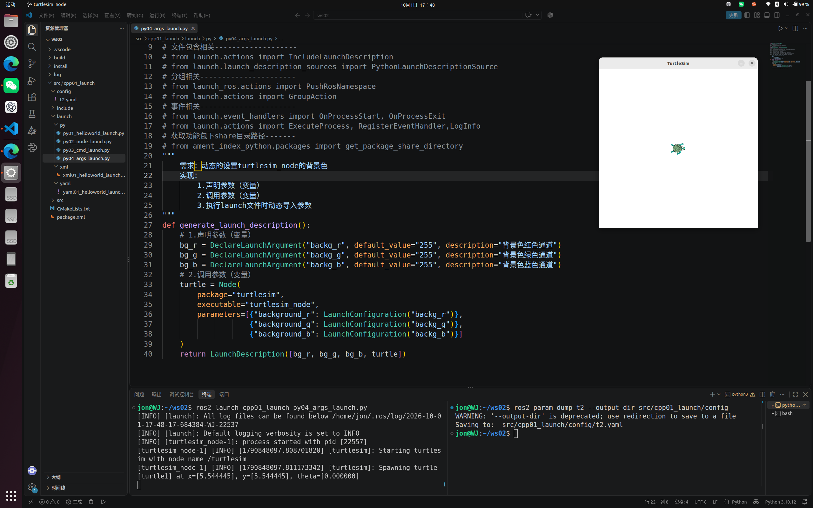

_图：参数文件加载与运行结果_

## 3.3 执行命令与动态参数
`py03_cmd_launch.py` 使用 `ExecuteProcess` 执行普通终端命令；`py04_args_launch.py` 使用 `DeclareLaunchArgument` 和 `LaunchConfiguration` 声明可在启动时修改的参数。

## 3.4 包含其他 Launch 文件
`py05_include_launch.py` 通过 `IncludeLaunchDescription` 复用其他 Launch 文件，并可使用 `launch_arguments` 覆盖其参数。

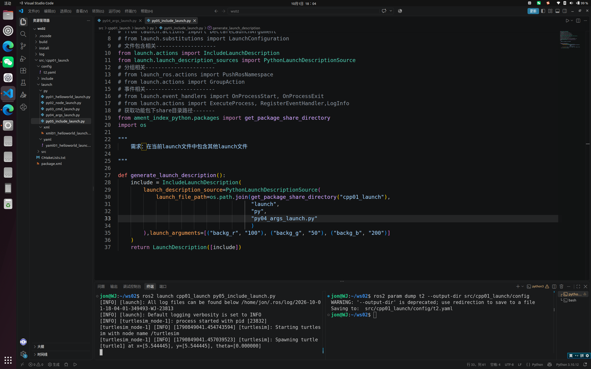

_图：Launch 文件包含练习_

## 3.5 分组与命名空间
`py06_group_launch.py` 使用 `GroupAction` 和 `PushRosNamespace` 对一组节点统一设置命名空间，适合多机器人或多模块场景。

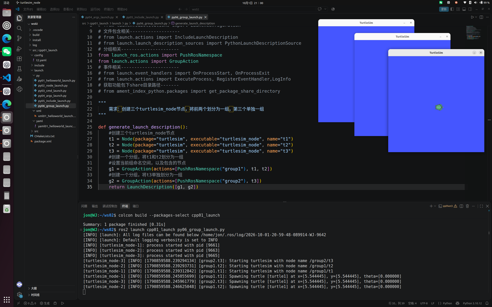

_图：Launch 分组与命名空间运行结果_

## 3.6 事件控制
`py07_event_launch.py` 使用 `RegisterEventHandler`、`OnProcessStart` 和 `OnProcessExit`：turtlesim 启动后调用 `/spawn` 生成新乌龟，进程退出时输出提示。

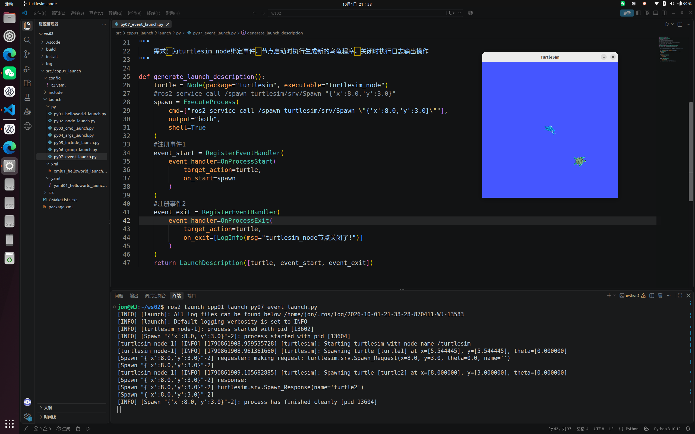

_图：进程启动事件与生成乌龟_

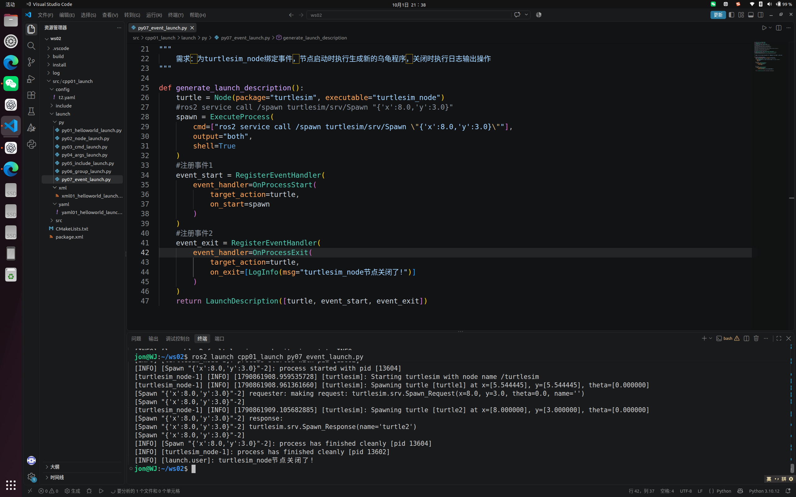

_图：进程退出事件与日志输出_

**参考：**

1. [Python Launch 简介](https://www.bilibili.com/video/BV15V4y1P744/?p=5)
2. [Python Launch Node 设置（上）](https://www.bilibili.com/video/BV15V4y1P744/?p=6)
3. [Python Launch Node 设置（下）](https://www.bilibili.com/video/BV15V4y1P744/?p=7)
4. [Python Launch 执行指令](https://www.bilibili.com/video/BV15V4y1P744/?p=8)
5. [Python Launch 参数设置](https://www.bilibili.com/video/BV15V4y1P744/?p=9)
6. [Python Launch 文件包含](https://www.bilibili.com/video/BV15V4y1P744/?p=10)
7. [Python Launch 分组设置](https://www.bilibili.com/video/BV15V4y1P744/?p=11)
8. [Python Launch 事件设置](https://www.bilibili.com/video/BV15V4y1P744/?p=12)
9. [Python Launch 事件设置补充](https://www.bilibili.com/video/BV15V4y1P744/?p=13)

# 四、XML 与 YAML Launch
## 4.1 基本写法
XML 层级清晰，YAML 写法简洁。两者都能设置节点、参数、命名空间、命令、文件包含和分组。

<launch>   <node pkg="turtlesim" exec="turtlesim_node" name="t1" output="screen"/> </launch>launch: - node:     pkg: turtlesim     exec: turtlesim_node     name: t1     output: screen

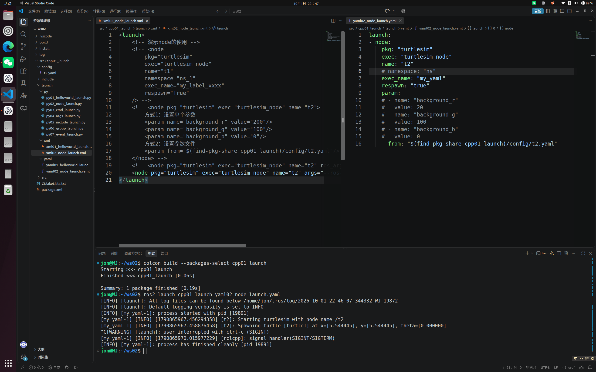

_图：XML 与 YAML 节点启动和配置_

## 4.2 本机对应练习
+ `xml01/yaml01`：基础启动；
+ `xml02/yaml02`：节点属性与参数文件；
+ `xml03/yaml03`：执行终端命令；
+ `xml04/yaml04`：动态启动参数；
+ `xml05/yaml05`：包含其他 Launch 文件；
+ `xml06/yaml06`：分组与命名空间。

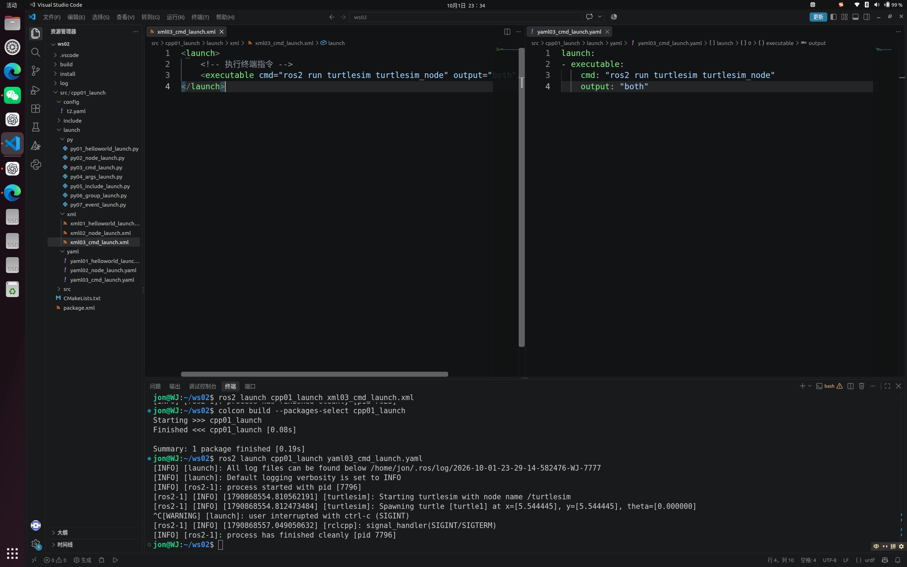

_图：XML 与 YAML 执行普通终端命令_

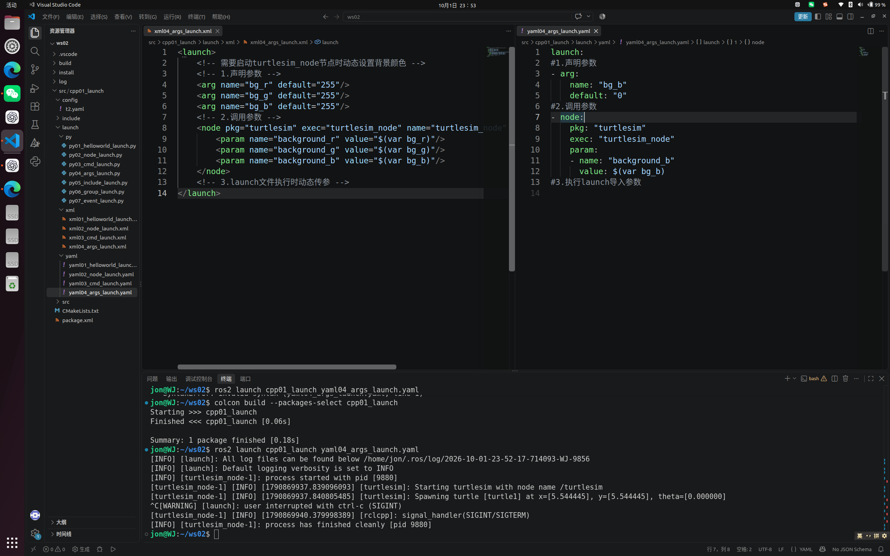

_图：XML 与 YAML 动态参数传入及运行结果_

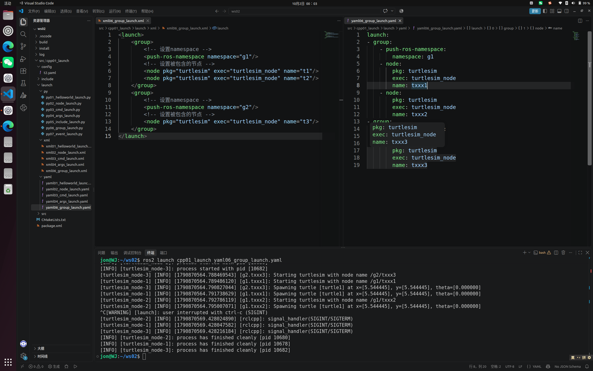

_图：XML 与 YAML 分组和命名空间_

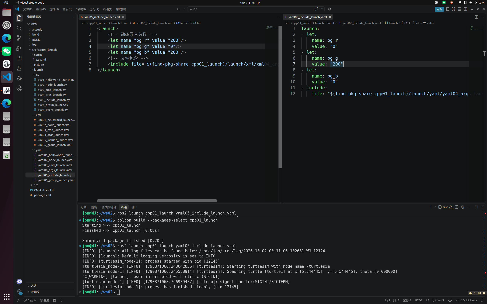

_图：XML 与 YAML 包含其他 Launch 文件_

## 4.3 格式选择
+ **Python：**功能最强，适合条件判断、事件、动态路径和复杂逻辑；
+ **XML：**结构直观，适合配置较固定的项目；
+ **YAML：**语法简洁，适合规模较小的静态配置。

**参考：**

1. [XML/YAML Launch Node 设置（上）](https://www.bilibili.com/video/BV15V4y1P744/?p=14)
2. [XML/YAML Launch Node 设置（下）](https://www.bilibili.com/video/BV15V4y1P744/?p=15)
3. [XML/YAML Launch 执行指令](https://www.bilibili.com/video/BV15V4y1P744/?p=16)
4. [XML/YAML Launch 参数设置](https://www.bilibili.com/video/BV15V4y1P744/?p=17)
5. [XML/YAML Launch 分组设置](https://www.bilibili.com/video/BV15V4y1P744/?p=18)
6. [XML/YAML Launch 文件包含](https://www.bilibili.com/video/BV15V4y1P744/?p=19)
7. [Launch 小结](https://www.bilibili.com/video/BV15V4y1P744/?p=20)

# 五、rosbag2 命令工具
## 5.1 rosbag2 的作用
rosbag2 会把一段时间内的话题名称、消息类型、时间戳和消息内容保存到数据包中。它可用于保存传感器与控制数据、复现现场问题、离线调试算法，以及让不同算法重复处理同一组数据。

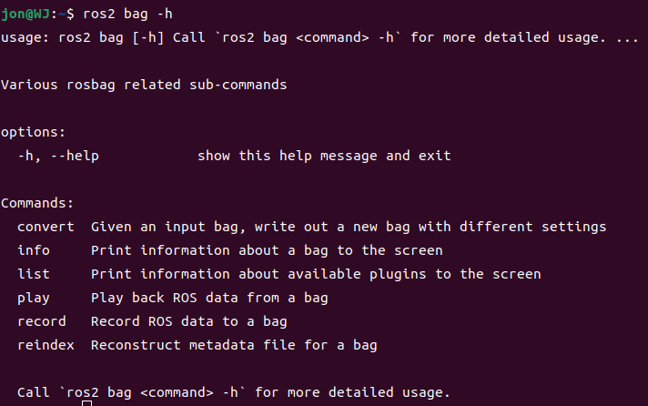

_图：ros2 bag 命令帮助_

## 5.2 录制、查看与回放
常用命令如下：

ros2 bag --help ros2 bag record /turtle1/cmd_vel ros2 bag record -o turtle_bag /turtle1/pose /turtle1/cmd_vel ros2 bag record -a ros2 bag info turtle_bag ros2 bag play turtle_bag

录制时使用 `Ctrl+C` 正常结束。数据目录中通常包含 `metadata.yaml` 和数据库文件（Humble 常见为 `.db3`）。已有同名目录时，rosbag2 不会直接覆盖，应更换输出名称或先妥善处理旧数据。

## 5.3 建议练习流程
1. 启动 turtlesim；
2. 录制 `/turtle1/pose` 和 `/turtle1/cmd_vel`；
3. 控制乌龟运动，再按 `Ctrl+C` 停止录制；
4. 用 `ros2 bag info` 检查话题、消息数量和持续时间；
5. 重新启动 turtlesim，并用 `ros2 bag play` 回放数据。

**参考：**

1. [rosbag2 的应用场景、概念与作用](https://www.bilibili.com/video/BV15V4y1P744/?p=21)
2. [rosbag2 命令工具 ros2 bag](https://www.bilibili.com/video/BV15V4y1P744/?p=22)

# 六、使用 C++ 操作 rosbag2
## 6.1 功能包与依赖
本机 C++ 功能包位于 `~/ws02/src/cpp02_rosbag`，包含 `demo01_writer.cpp` 和 `demo02_reader.cpp`。主要依赖为 `rclcpp`、`rosbag2_cpp` 和 `geometry_msgs`。

cd ~/ws02 colcon build --packages-select cpp02_rosbag source install/setup.bash

## 6.2 C++ 录制程序
`demo01_writer` 创建 `rosbag2_cpp::Writer`，打开相对目录 `my_bag`，订阅 `/turtle1/cmd_vel`，再将收到的 `geometry_msgs/msg/Twist` 序列化并写入数据包。只有话题实际发布消息时，bag 中才会有数据。

cd ~/ws02 ros2 run turtlesim turtlesim_node # 另一个终端 ros2 run cpp02_rosbag demo01_writer # 再开终端发布控制数据 ros2 run turtlesim turtle_teleop_key

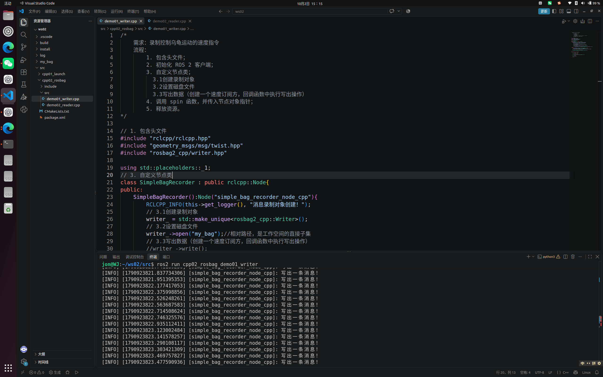

_图：C++ 程序录制 turtlesim 控制数据_

## 6.3 C++ 读取程序
`demo02_reader` 使用 `rosbag2_cpp::Reader` 打开 `my_bag`，逐条读取并反序列化 `Twist` 消息，然后打印线速度和角速度。它是读取并输出数据，不会自动驱动乌龟；要让 ROS 2 节点重新接收话题，应使用 `ros2 bag play my_bag`。

cd ~/ws02 ros2 run cpp02_rosbag demo02_reader # 或真正向 ROS 2 网络回放 ros2 bag play my_bag

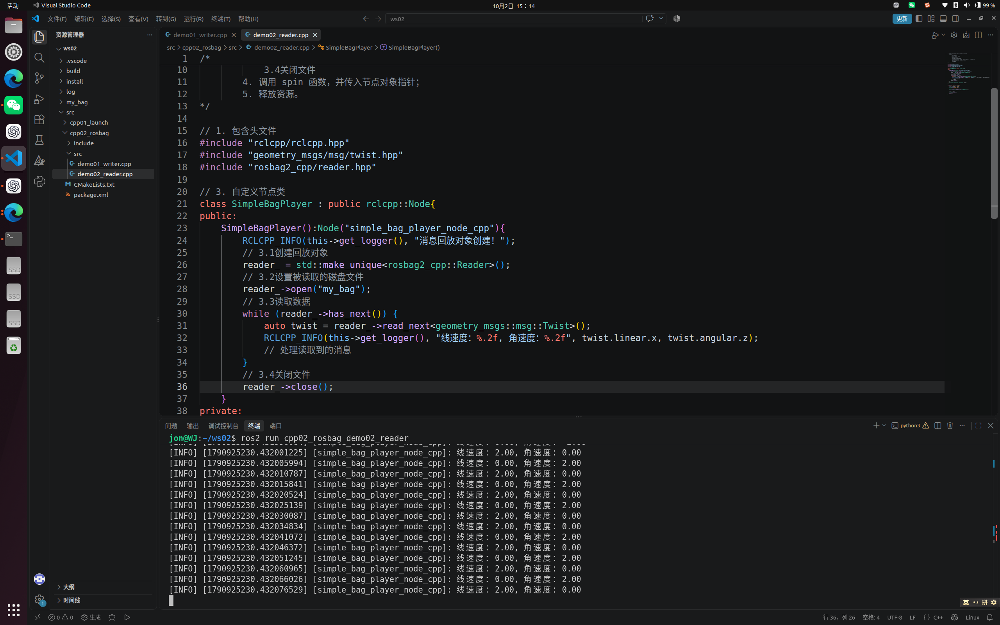

_图：C++ 程序读取 rosbag2 数据_

**参考：**

1. [rosbag2 C++ 编程——案例源码分析](https://www.bilibili.com/video/BV15V4y1P744/?p=23)
2. [rosbag2 C++ 编程——框架搭建](https://www.bilibili.com/video/BV15V4y1P744/?p=24)
3. [rosbag2 C++ 编程——录制数据](https://www.bilibili.com/video/BV15V4y1P744/?p=25)
4. [rosbag2 C++ 编程——读取数据](https://www.bilibili.com/video/BV15V4y1P744/?p=26)
5. [rosbag2 Python 实现说明](https://www.bilibili.com/video/BV15V4y1P744/?p=27)

# 七、实际问题及解决过程
## 7.1 功能包或可执行程序找不到
先确认在工作空间根目录编译，而不是在 `~/ws02/src` 中生成错误的 `build/install/log`。然后重新加载 `~/ws02/install/setup.bash`，并检查 `ros2 pkg list` 与 `ros2 pkg executables cpp02_rosbag`。

## 7.2 修改 Launch 后结果没有变化
`ros2 launch` 读取的是 `install` 中的副本。源文件修改后，需要重新执行 `colcon build --packages-select cpp01_launch`。

## 7.3 t2.yaml 没有生效
节点使用命名空间后完整名称为 `/ns/t2`，参数文件顶层键也必须写成 `/ns/t2`，并在其下放置 `ros__parameters`。

## 7.4 rosbag2 没有录到数据
录制程序只是订阅 `/turtle1/cmd_vel`。若没有运行键盘控制或其他发布者，该话题没有新消息，bag 就是空的。可用 `ros2 topic hz /turtle1/cmd_vel` 检查是否持续发布。

## 7.5 C++ 读取程序没有输出
程序使用相对路径 `my_bag`，实际位置取决于启动命令时的当前目录。应在包含该目录的位置运行，或把源码改成明确的绝对路径。还要先用 `ros2 bag info my_bag` 确认数据包中确实包含消息。

# 八、总结
本阶段在 `~/ws02` 中完成了 Python、XML、YAML 三种 Launch 写法，以及 rosbag2 命令行和 C++ 编程练习。Launch 解决“如何稳定启动整套系统”，rosbag2 解决“如何保存并复现运行数据”。两者结合后，可以明显提高机器人项目的启动效率、调试效率和问题复现能力。

**参考：**

1. [Launch 与 rosbag2 总结](https://www.bilibili.com/video/BV15V4y1P744/?p=28)

补充资料：[ROS2 Tuition 第四章：Launch、rosbag2 与 rqt](https://rzl6.github.io/ROS2_Tuition/di-4-zhang-ros2-gong-ju-zhi-launch-rosbag2-yu-rqt.html)
