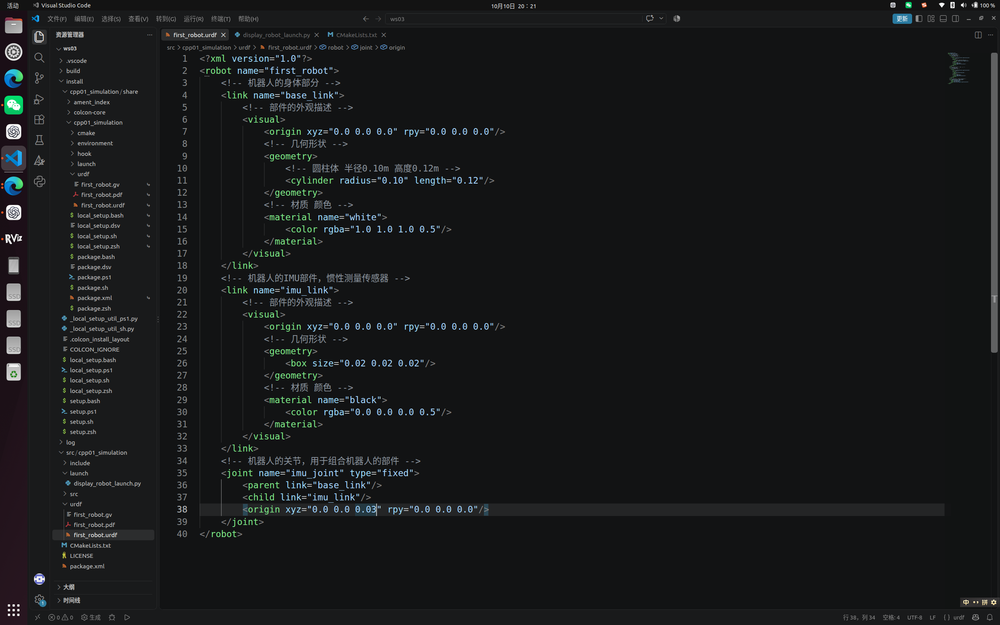
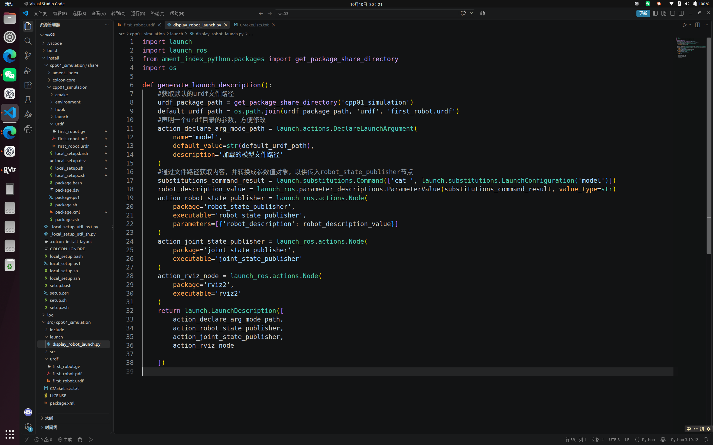
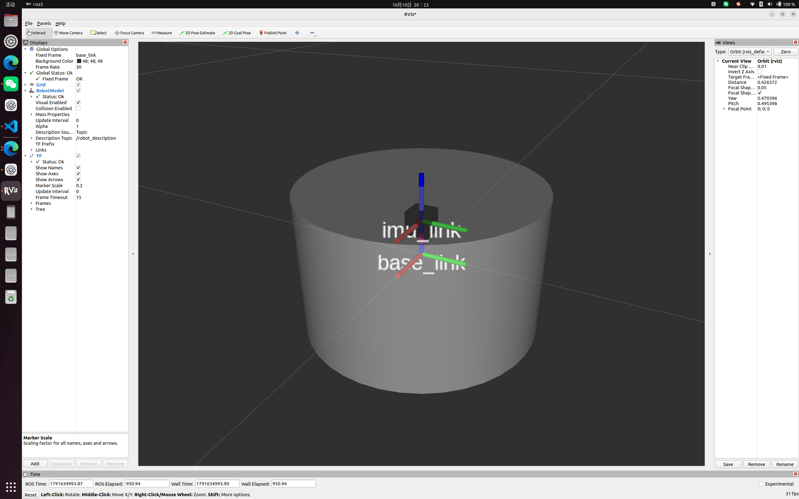
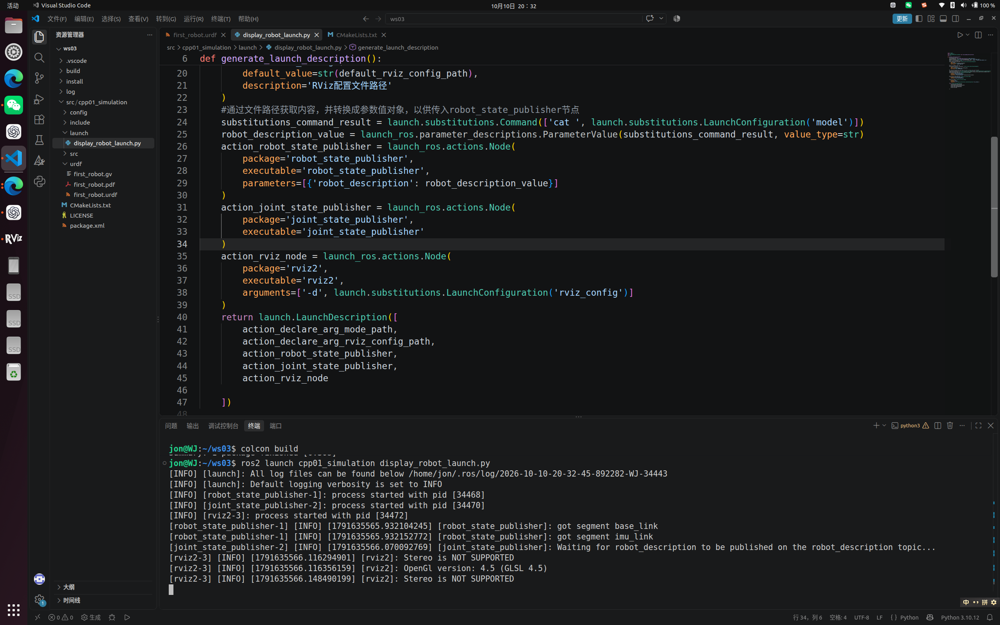
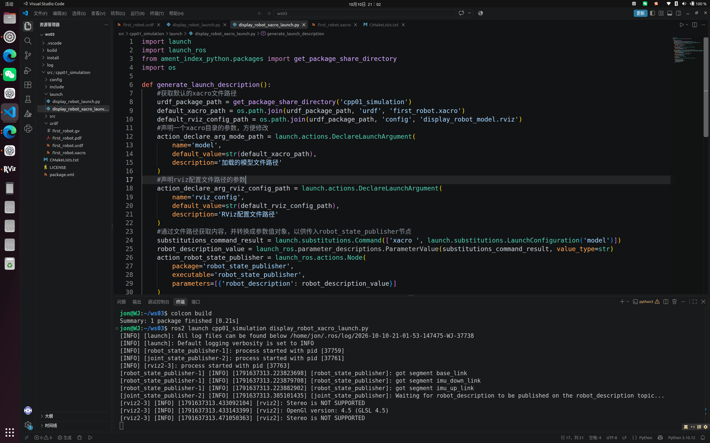
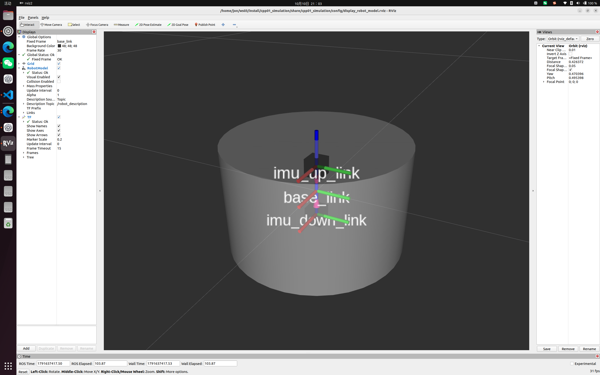

# ROS 2 机器人建模与仿真学习

实践环境：Ubuntu 22.04.5 LTS + ROS 2 Humble  
工作空间：`~/ws03`  
功能包：`cpp01_simulation`

## 一、学习目标

本阶段主要学习 ROS 2 机器人建模与仿真：

1. 理解机器人建模与仿真的作用；
2. 掌握 URDF 中连杆和关节的基本概念；
3. 使用 RViz2 显示机器人模型；
4. 使用 Xacro 简化机器人模型；
5. 为模型添加碰撞、质量和惯性属性；
6. 在 Gazebo 中加载并控制机器人；
7. 了解激光雷达、IMU 和深度相机仿真；
8. 了解 `ros2_control` 的基本作用。

## 二、机器人建模与仿真概述

机器人建模是通过文件描述机器人的结构、尺寸、关节和传感器。仿真则是在计算机中模拟机器人的运动、碰撞和传感器数据。

本阶段主要使用以下工具：

| 工具 | 作用 |
| --- | --- |
| URDF | 描述机器人结构 |
| Xacro | 简化和复用 URDF |
| RViz2 | 显示机器人模型和 ROS 2 数据 |
| Gazebo | 模拟物理环境和传感器 |
| ros2_control | 管理机器人控制器和硬件接口 |

RViz2 主要用于数据可视化，本身不进行物理仿真；Gazebo 可以模拟重力、碰撞、摩擦和传感器。

**学习资料：**

1. [6.1 机器人建模与仿真概述](https://www.bilibili.com/video/BV1CB19Y1Ew8/)

## 三、URDF 机器人建模

### 3.1 连杆与关节

URDF 是 ROS 中常用的机器人模型描述格式，主要由连杆和关节组成。

+ `link` 表示机器人部件，例如车身、车轮和传感器；
+ `joint` 表示两个部件之间的连接关系；
+ `origin` 用于设置部件的位置和姿态；
+ `visual` 用于设置部件的外观。

常见关节类型包括：

| 类型 | 作用 |
| --- | --- |
| `fixed` | 固定连接 |
| `continuous` | 连续旋转 |
| `revolute` | 在限制范围内旋转 |
| `prismatic` | 沿指定方向移动 |

本次练习创建了机器人主体和 IMU 部件，并使用固定关节将两个部件连接起来。



_图：URDF 机器人主体、IMU 和固定关节代码_

### 3.2 使用 RViz2 显示模型

RViz2 不会直接读取 URDF 文件，需要通过相关节点发布机器人描述、关节状态和 TF。

主要节点包括：

+ `robot_state_publisher`：发布机器人模型和 TF；
+ `joint_state_publisher`：发布关节状态；
+ `rviz2`：显示机器人模型。

运行逻辑为：

```text
读取 URDF
→ 发布机器人描述
→ 发布关节状态和 TF
→ RViz2 显示模型
```

编译并启动：

```bash
cd ~/ws03
colcon build --packages-select cpp01_simulation --symlink-install
source install/setup.bash
ros2 launch cpp01_simulation display_robot_launch.py
```

在 RViz2 中需要设置正确的 Fixed Frame，并添加 `RobotModel`。



_图：机器人模型 Launch 文件_



_图：RViz2 中的机器人模型_



_图：launch中配置启动保存的rviz文件_

### 3.3 Xacro

当机器人部件增多时，直接编写 URDF 会出现大量重复内容。Xacro 可以定义常量、进行简单计算、编写可复用的宏，并将机器人模型拆分为多个文件。

因此，简单模型可以直接使用 URDF，复杂机器人通常使用 Xacro 编写。



_图：编写xacro文件简化urdf_



_图：运行试验_

**学习资料：**

1. [6.2 使用 URDF 创建机器人](https://www.bilibili.com/video/BV1RT1BYQEAk/)
2. [6.2.2 在 RViz 中显示机器人](https://www.bilibili.com/video/BV1Vq2LYoECn/)
3. [6.2.3 使用 Xacro 简化 URDF](https://www.bilibili.com/video/BV1WY2WYaEwc)
4. [6.2.5 完善机器人执行器部件](https://www.bilibili.com/video/BV1s92VYTEc7/)
5. [6.2.6 贴合地面并添加虚拟部件](https://www.bilibili.com/video/BV1xU2mYBE9u/)

## 四、模型物理属性

RViz2 主要显示模型外观，而 Gazebo 还需要模型具有物理属性。

机器人部件通常包含：

| 属性 | 作用 |
| --- | --- |
| `visual` | 决定模型显示效果 |
| `collision` | 决定模型碰撞范围 |
| `inertial` | 描述质量、质心和惯性 |

如果没有正确设置碰撞、质量和惯性，模型在 Gazebo 中可能出现抖动、下落异常或者无法正常运动。

_图：模型碰撞属性代码_

_图：模型质量与惯性属性代码_

**学习资料：**

1. [6.3.1 为机器人部件添加碰撞属性](https://www.bilibili.com/video/BV11J29YQESi/)
2. [6.3.2 为机器人部件添加质量与惯性](https://www.bilibili.com/video/BV1wJ2BYqER6/)

## 五、Gazebo 机器人仿真

Gazebo 可以模拟：

+ 重力；
+ 碰撞；
+ 摩擦；
+ 关节运动；
+ 机器人与环境的交互；
+ 雷达、IMU 和相机等传感器。

机器人加载到 Gazebo 后，可以通过两轮差速插件接收速度指令并控制左右车轮。

基本运行过程为：

```text
加载机器人模型
→ 加载 Gazebo 插件
→ 接收速度指令
→ 控制左右车轮
→ 机器人移动
→ 发布里程计和 TF
```

_图：Gazebo 仿真世界_

_图：Gazebo 中加载机器人模型_

_图：两轮差速机器人运动结果_

**学习资料：**

1. [6.4.1 安装与使用 Gazebo 构建世界](https://www.bilibili.com/video/BV1oamGYxEty/)
2. [6.4.2 在 Gazebo 中加载机器人模型](https://www.bilibili.com/video/BV1ho2dYNE6T/)
3. [6.4.3 使用 Gazebo 标签扩展 URDF](https://www.bilibili.com/video/BV1k8mNYyEjW/)
4. [第六章仿真课程合集](https://www.bilibili.com/video/BV1RT1BYQEAk/)

## 六、传感器仿真

### 6.1 激光雷达

激光雷达用于测量机器人与周围障碍物的距离，数据通常发布到 `/scan`，可以用于 SLAM 建图、定位和避障。

### 6.2 IMU

IMU 用于测量机器人的角速度和线加速度，可以辅助判断机器人的姿态和运动状态。

### 6.3 深度相机

深度相机可以同时获得图像和距离信息，常用于三维感知、避障和目标识别。

_图：激光雷达仿真效果_

_图：IMU 话题数据_

_图：深度相机仿真效果_

**学习资料：**

1. [6.4.7 深度相机传感器仿真](https://www.bilibili.com/video/BV1SVy8YQEzu/)
2. [第六章仿真课程合集](https://www.bilibili.com/video/BV1RT1BYQEAk/)

## 七、ros2_control

`ros2_control` 用于统一管理机器人控制器和硬件接口。

基本关系为：

```text
上层控制节点
→ 控制器
→ ros2_control
→ Gazebo 仿真硬件或真实硬件
```

常见控制器包括：

+ 关节状态发布控制器；
+ 位置控制器；
+ 速度控制器；
+ 两轮差速控制器。

使用 `ros2_control` 后，可以减少仿真机器人和真实机器人之间的控制代码差异。

_图：ros2_control 配置_

_图：控制器运行结果_

**学习资料：**

1. [6.5.2 使用 Gazebo 接入 ros2_control](https://www.bilibili.com/video/BV1VayHYqEUe/)
2. [第六章仿真课程合集](https://www.bilibili.com/video/BV1RT1BYQEAk/)

## 八、总结

通过本阶段学习，我理解了 URDF 中连杆与关节的关系，并完成了机器人主体和传感器部件的建模。

目前已经能够通过 Launch 启动模型发布节点和 RViz2。后续将继续学习 Xacro、Gazebo、传感器仿真和 `ros2_control`，将静态机器人模型逐步扩展为可以运动和感知环境的仿真机器人。
