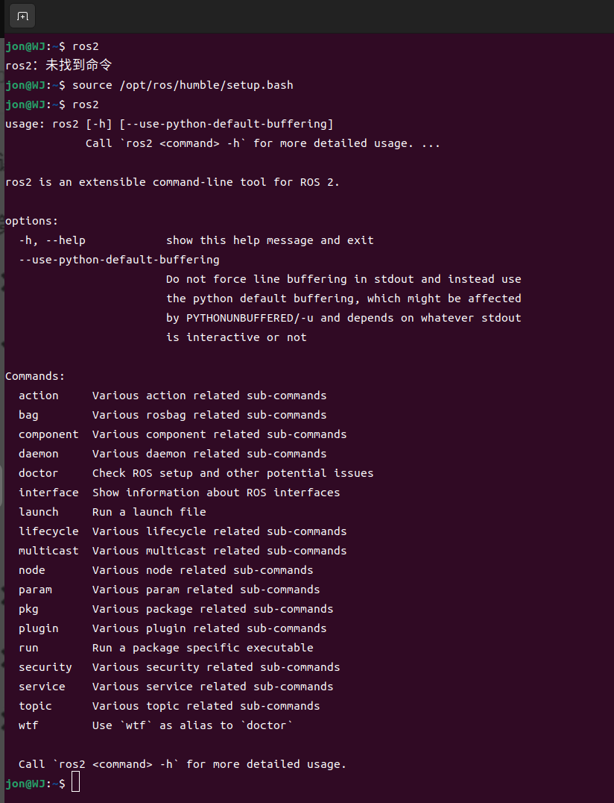
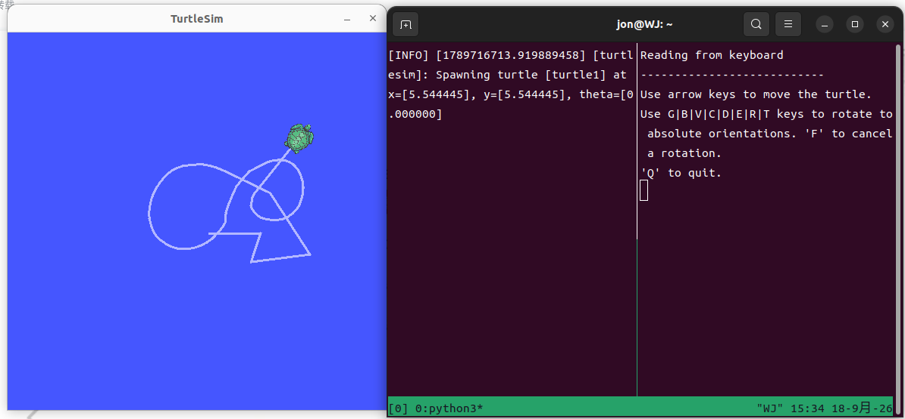
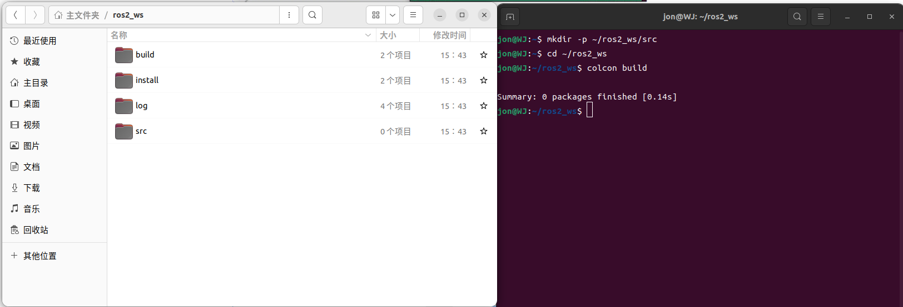
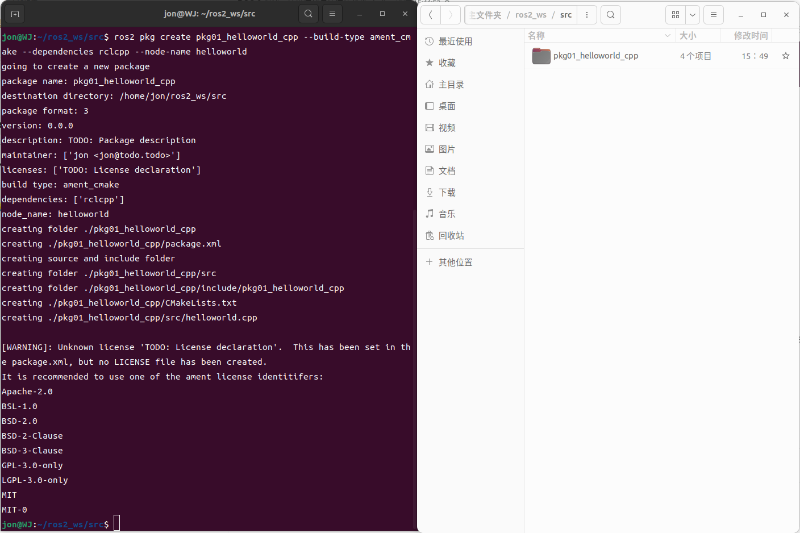
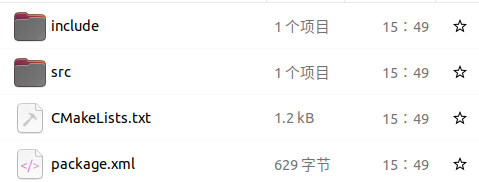
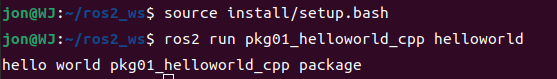
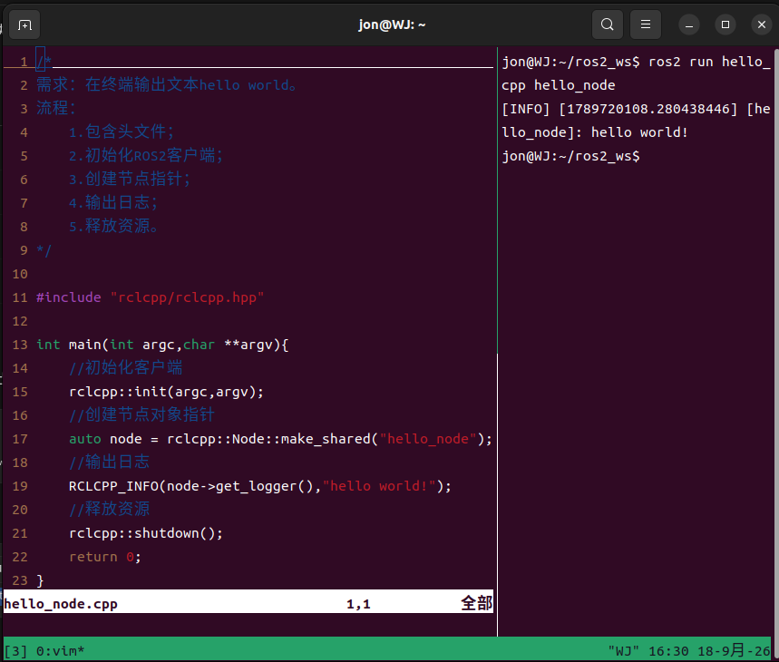
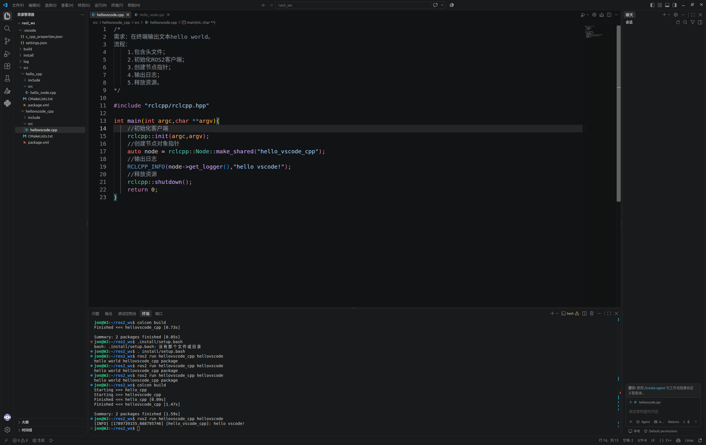
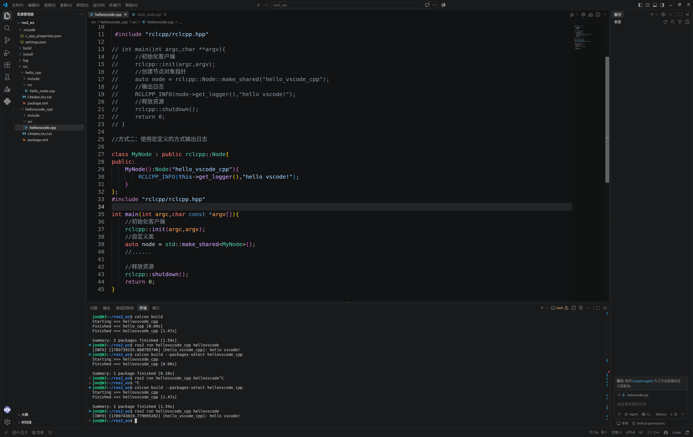
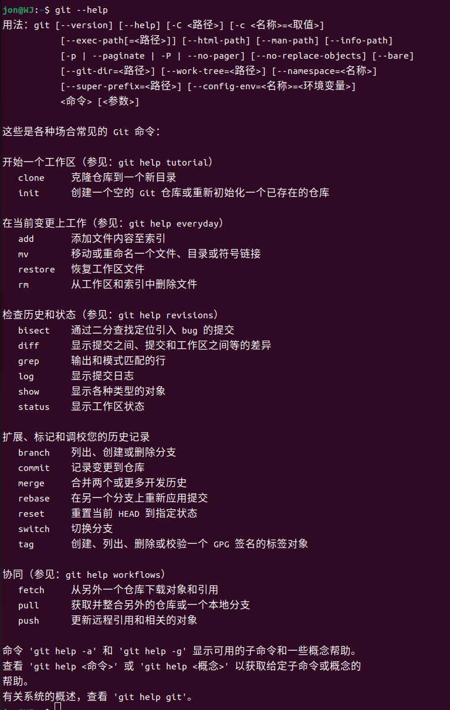

# ROS 2 概述、环境搭建与学习

学习资料：[ROS2 Tuition 第一章](https://rzl6.github.io/ROS2_Tuition/chapter1.html)  
实践环境：Ubuntu 22.04.5 LTS、ROS 2 Humble、C++  
当前工作空间：`~/ws00`  
当前功能包：`hello_cpp`、`hellovscode_cpp`

## 一、学习目标

本阶段主要认识 ROS 2 的基本体系，并完成开发环境安装和 C++ 节点入门，具体目标包括：

1. 理解 ROS 2 的定位以及它与 Ubuntu 的关系；
2. 了解节点、话题、服务、动作和参数等基本概念；
3. 完成 ROS 2 Humble Desktop 和常用开发工具的安装；
4. 理解工作空间、功能包、源码和构建产物之间的关系；
5. 掌握 C++ 节点“创建—配置—编译—运行”的基本流程；
6. 能够使用 VS Code、Vim、tmux、Git 和 ROS 2 命令行辅助开发；
7. 了解 ROS 2 的体系结构和主要应用方向。

## 二、ROS 2 概述

### 2.1 为什么需要 ROS 2

机器人由机械结构、传感器、执行器、嵌入式设备和上层软件共同组成。如果把摄像头、雷达、定位、导航和电机控制等功能全部写入一个程序，代码会难以维护，也不利于模块复用。

ROS 2 将复杂系统拆分为多个职责明确的节点。例如：

+ 摄像头节点负责发布图像；
+ 识别节点负责处理图像；
+ 导航节点负责规划路线；
+ 底盘节点负责执行速度指令。

节点通过标准通信接口交换数据，使不同模块可以独立开发、测试和替换。

### 2.2 ROS 2 不是传统操作系统

ROS 是 Robot Operating System 的缩写，但它不是 Ubuntu 或 Windows 这类直接管理硬件的操作系统。更准确地说，ROS 2 是运行在操作系统上的机器人软件开发框架、通信中间件和工具集合。

本机的软件层次可以表示为：

```plain
计算机硬件
└── Ubuntu 22.04 操作系统
    └── ROS 2 Humble
        └── 节点、驱动、算法和机器人应用
```

Ubuntu 负责进程、内存、文件、网络和硬件管理；ROS 2 负责节点发现、数据通信、参数、启动、调试和可视化。

### 2.3 ROS 2 的基本组成

ROS 2 生态可以概括为四部分：

| 组成 | 主要作用 |
| --- | --- |
| 通信 Plumbing | 节点发现和消息传输，底层通常使用 DDS |
| 工具 Tools | `ros2`<br/> 命令、Launch、RViz2、rqt 和 rosbag2 |
| 功能 Capabilities | 驱动、定位、导航、机械臂和视觉等功能包 |
| 社区 Community | 共同维护软件包、文档和生态 |


### 2.4 核心通信概念

| 概念 | 作用 |
| --- | --- |
| 节点 Node | 正在运行并负责一项具体功能的程序 |
| 话题 Topic | 持续传输数据的发布—订阅通信 |
| 服务 Service | 一次请求对应一次响应 |
| 动作 Action | 支持进度反馈、结果和取消的耗时任务 |
| 参数 Parameter | 节点运行时使用的配置数据 |


### 2.5 ROS 2 的主要特点

ROS 2 使用分布式节点发现机制，并通过 DDS 和 QoS 提供灵活的通信能力。它支持 Linux、Windows、macOS 和部分实时系统，也更适合嵌入式、多设备和多机器人应用。

学习资料：

1. 【ROS2理论与实践】[第 8 集：ROS2 简介——ROS2 优势（横向比较）](https://www.bilibili.com/video/BV1VB4y137ys/?p=8)
2. 【ROS2理论与实践】[第 9 集：ROS2 简介——ROS2 优势（纵向比较）](https://www.bilibili.com/video/BV1VB4y137ys/?p=9)

## 三、ROS 2 环境安装与配置

### 3.1 当前环境

| 项目 | 当前结果 |
| --- | --- |
| 操作系统 | Ubuntu 22.04.5 LTS（Jammy） |
| CPU 架构 | amd64 |
| 当前内核 | `6.8.0-138-generic` |
| ROS 2 发行版 | Humble Hawksbill |
| 安装类型 | Desktop 完整桌面版 |
| ROS 2 安装目录 | `/opt/ros/humble` |
| 当前工作空间 | `/home/jon/ws00` |
| 根分区剩余空间 | 约 139 GB |


检查系统和 ROS 2 环境：

```bash
lsb_release -a
uname -m
uname -r
printenv ROS_DISTRO
```

### 3.2 安装方案

本机采用 Ubuntu 原生 APT 二进制安装方式，主要过程如下：

1. 检查 Ubuntu 版本、CPU 架构、UTF-8 和磁盘空间；
2. 安装基础开发工具并启用 Universe 软件仓库；
3. 使用官方 `ros2-apt-source` 添加软件源；
4. 更新系统软件包；
5. 安装 `ros-humble-desktop` 和 `ros-dev-tools`；
6. 重启后检查 ROS 2 命令和系统状态。

主要命令：

```bash
sudo apt update
sudo apt install software-properties-common curl ca-certificates \
  build-essential cmake
sudo add-apt-repository universe
sudo apt upgrade
sudo apt install ros-humble-desktop ros-dev-tools
```



图：ROS 2 Humble 安装及环境检查结果

### 3.3 环境变量配置

为了让新终端自动加载 ROS 2 和当前工作空间，`~/.bashrc` 已加入：

```bash
source /opt/ros/humble/setup.bash
source /home/jon/ws01/install/setup.bash
```

因此新开终端后不需要重复执行 `source`。修改 `.bashrc` 后，可以在当前终端执行：

```bash
source ~/.bashrc
```

当前 `rosdep` 尚未初始化。需要使用依赖安装功能时再执行：

```bash
sudo rosdep init
rosdep update
```

学习资料：

1. 【ROS2理论与实践】[第 12 集：ROS2 安装——步骤1设置编码](https://www.bilibili.com/video/BV1VB4y137ys/?p=12)
2. 【ROS2理论与实践】[第 13 集：ROS2 安装——步骤2启动 Universe 存储库](https://www.bilibili.com/video/BV1VB4y137ys/?p=13)
3. 【ROS2理论与实践】[第 14 集：ROS2 安装——步骤3设置软件源](https://www.bilibili.com/video/BV1VB4y137ys/?p=14)
4. 【ROS2理论与实践】[第 15 集：ROS2 安装——步骤4安装 ROS2](https://www.bilibili.com/video/BV1VB4y137ys/?p=15)
5. 【ROS2理论与实践】[第 16 集：ROS2 安装——步骤5配置环境](https://www.bilibili.com/video/BV1VB4y137ys/?p=16)
6. 【ROS2理论与实践】[第 17 集：ROS2 安装——卸载方式与小结](https://www.bilibili.com/video/BV1VB4y137ys/?p=17)

## 四、ROS 2 安装测试

### 4.1 turtlesim 小乌龟测试

终端 1 启动小乌龟窗口：

```bash
ros2 run turtlesim turtlesim_node
```

终端 2 启动键盘控制节点：

```bash
ros2 run turtlesim turtle_teleop_key
```

第二个终端需要保持键盘焦点，然后使用方向键控制小乌龟。该练习可以验证：

+ ROS 2 功能包和可执行程序能否正常启动；
+ 图形界面能否正常显示；
+ 两个节点能否通过话题建立通信。

也可以在 tmux 的两个窗格中分别运行上述命令。



图：使用 tmux 运行 turtlesim 节点和键盘控制节点

学习资料：

1. 【ROS2理论与实践】[第 18 集：ROS2 安装——测试 ROS2](https://www.bilibili.com/video/BV1VB4y137ys/?p=18)

## 五、colcon、工作空间与功能包

### 5.1 colcon 的作用

`colcon` 是 ROS 2 常用的构建工具。它能够分析功能包依赖关系，按照正确顺序编译多个功能包，并生成运行环境。

本阶段的 ROS 2 入门工作空间为 `~/ws00`，使用以下命令编译：

```bash
cd ~/ws00
colcon build
```

只编译指定功能包：

```bash
colcon build --packages-select hello_cpp
```

参数应写成 `--packages-select`，不能写成 `--package-select`。

### 5.2 工作空间结构

当前工作空间结构为：

```plain
~/ws00/
├── src/       源代码
├── build/     编译过程文件
├── install/   安装结果和环境脚本
└── log/       构建日志
```

通常只直接编辑 `src` 中的源码，其他三个目录由 `colcon` 自动生成。编译必须在 `~/ws00` 执行，不能在 `~/ws00/src` 中执行，否则会在 `src` 下错误生成另一套构建目录。



图：工作空间的 src、build、install 和 log 目录

### 5.3 功能包

功能包是 ROS 2 组织代码和资源的基本单位。该入门工作空间实际包含：

```plain
hello_cpp
hellovscode_cpp
```

可以执行以下命令确认：

```bash
cd ~/ws00
colcon list
```

C++ 功能包通常包含：

+ `package.xml`：包名、版本和依赖信息；
+ `CMakeLists.txt`：编译和安装规则；
+ `src/`：C++ 源文件；
+ `include/`：项目头文件。



图：C++ 功能包的基础目录和配置文件



图：创建功能包并检查配置文件



图：功能包编译与运行测试结果

学习资料：

1. 【ROS2理论与实践】[第 19 集：ROS2 安装——安装 colcon 构建工具](https://www.bilibili.com/video/BV1VB4y137ys/?p=19)

## 六、C++ 节点开发流程

### 6.1 基本流程

一个 C++ ROS 2 节点通常按照以下步骤开发：

1. 创建工作空间和功能包；
2. 编写 C++ 源文件；
3. 在 `CMakeLists.txt` 中创建并安装可执行目标；
4. 在 `package.xml` 中声明依赖；
5. 使用 `colcon build` 编译；
6. 加载工作空间环境；
7. 使用 `ros2 run` 启动节点。

### 6.2 基础节点模板

```cpp
#include "rclcpp/rclcpp.hpp"

class MyNode : public rclcpp::Node
{
public:
    MyNode() : Node("my_node")
    {
        RCLCPP_INFO(this->get_logger(), "hello ROS2");
    }
};

int main(int argc, char *argv[])
{
    rclcpp::init(argc, argv);
    rclcpp::spin(std::make_shared<MyNode>());
    rclcpp::shutdown();
    return 0;
}
```

编译并运行第一个 C++ HelloWorld 节点：

```bash
cd ~/ws00
colcon build --packages-select hello_cpp
source install/setup.bash
ros2 run hello_cpp hello_node
```

第二个练习包可以这样运行：

```bash
cd ~/ws00
colcon build --packages-select hellovscode_cpp
source install/setup.bash
ros2 run hellovscode_cpp hellovscode
```

`hello_cpp` 的可执行程序名为 `hello_node`，输出 `hello world!`；`hellovscode_cpp` 的可执行程序名为 `hellovscode`，输出 `hello vscode!`。

当前 `~/.bashrc` 自动加载的是 ROS 2 Humble 和 `~/ws01/install/setup.bash`，并没有自动加载 `~/ws00`。因此运行上述入门包前，需先在当前终端执行 `source ~/ws00/install/setup.bash`。

`~/ws01` 是后续话题、服务、动作和参数通信练习使用的独立工作空间，不与本节的 HelloWorld 工作空间混用。



图：早期 C++ HelloWorld 节点的编译与运行练习

学习资料：

1. 【ROS2理论与实践】[第 21 集：ROS2 快速体验——HelloWorld（C++）基本流程](https://www.bilibili.com/video/BV1VB4y137ys/?p=21)
2. 【ROS2理论与实践】[第 22 集：ROS2 快速体验——HelloWorld（C++）源码编写](https://www.bilibili.com/video/BV1VB4y137ys/?p=22)

## 七、开发工具

### 7.1 常用工具

| 工具 | 主要作用 |
| --- | --- |
| VS Code | 编写、搜索和调试代码 |
| Vim | 在终端中快速修改代码和配置 |
| tmux | 分屏并保留终端会话 |
| Git | 下载源码和版本控制 |
| colcon | 构建 ROS 2 工作空间 |
| GCC、G++、CMake | C++ 编译工具链 |
| Terminator | 图形化多窗口终端工具 |


使用 VS Code 打开当前工作空间：

```bash
cd ~/ws00
code .
```

VS Code 的 C++ 扩展当前读取：

```plain
${workspaceFolder}/build/compile_commands.json
```

该编译数据库已经重新生成并包含当前工作空间中的 C++ 源文件。出现头文件红线时，应优先检查实际编译是否成功以及 `compile_commands.json` 是否包含当前文件。



图：使用 VS Code 编写和检查 ROS 2 C++ 程序



图：将基础节点修改为继承 `rclcpp::Node` 的形式

### 7.2 Git 的基本用途

```bash
git --version
git clone <仓库地址>
git status
```

`git clone` 用于下载源代码，`git status` 用于查看修改状态。第三方 ROS 2 功能包通常放入工作空间的 `src` 目录，然后使用 rosdep 安装依赖并通过 colcon 编译。



图：Git 版本检查和基础命令练习

学习资料：

1. 【ROS2理论与实践】[第 26 集：集成开发环境搭建——VS Code 下载安装与启动](https://www.bilibili.com/video/BV1VB4y137ys/?p=26)
2. 【ROS2理论与实践】[第 27 集：集成开发环境搭建——VS Code 安装插件](https://www.bilibili.com/video/BV1VB4y137ys/?p=27)
3. 【ROS2理论与实践】[第 28 集：集成开发环境搭建——VS Code includePath 配置](https://www.bilibili.com/video/BV1VB4y137ys/?p=28)
4. 【ROS2理论与实践】[第 29 集：集成开发环境搭建——VS Code 程序编写](https://www.bilibili.com/video/BV1VB4y137ys/?p=29)
5. 【ROS2理论与实践】[第 31 集：集成开发环境搭建——安装 Terminator](https://www.bilibili.com/video/BV1VB4y137ys/?p=31)
6. 【ROS2理论与实践】[第 32 集：集成开发环境搭建——安装 Git 与小结](https://www.bilibili.com/video/BV1VB4y137ys/?p=32)
7. 【ROS2理论与实践】[第 34 集：ROS2 体系框架——文件系统与编码风格](https://www.bilibili.com/video/BV1VB4y137ys/?p=34)
8. 【ROS2理论与实践】[第 35 集：ROS2 体系框架——初始化与资源释放](https://www.bilibili.com/video/BV1VB4y137ys/?p=35)
9. 【ROS2理论与实践】[第 36 集：ROS2 体系框架——配置文件](https://www.bilibili.com/video/BV1VB4y137ys/?p=36)

## 八、ROS 2 体系框架

### 8.1 三层结构

ROS 2 可以从下到上理解为三层：

1. 操作系统层：Ubuntu、Windows、macOS 或 RTOS；
2. 中间件层：DDS、RMW、客户端库和通信接口；
3. 应用层：节点、功能包、算法和机器人应用。

普通开发者的主要工作集中在应用层，通过 `rclcpp` 使用 ROS 2 提供的通信和管理能力。

### 8.2 常用工具与模块

+ `ros2 pkg`：创建或查询功能包；
+ `ros2 run`：运行功能包中的可执行程序；
+ `colcon build`：编译工作空间；
+ Launch：一次启动并配置多个节点；
+ TF2：管理坐标系之间的空间关系；
+ RViz2：显示机器人模型、地图、雷达和路径；
+ rqt：提供图形化调试工具；
+ rosbag2：录制和回放通信数据。

### 8.3 功能包的三种来源

1. 使用 APT 安装官方或社区提供的二进制包；
2. 从 Git 仓库下载源码后自行编译；
3. 根据项目需求自己创建功能包。

APT 软件包名称通常为：

```bash
sudo apt install ros-humble-<功能包名称>
```

学习资料：

1. 【ROS2理论与实践】[第 33 集：ROS2 体系框架——文件系统概览](https://www.bilibili.com/video/BV1VB4y137ys/?p=33)
2. 【ROS2理论与实践】[第 34 集：ROS2 体系框架——文件系统与编码风格](https://www.bilibili.com/video/BV1VB4y137ys/?p=34)
3. 【ROS2理论与实践】[第 37 集：ROS2 体系框架——文件系统常用命令](https://www.bilibili.com/video/BV1VB4y137ys/?p=37)
4. 【ROS2理论与实践】[第 38 集：ROS2 体系框架——核心模块与通信](https://www.bilibili.com/video/BV1VB4y137ys/?p=38)
5. 【ROS2理论与实践】[第 40 集：ROS2 体系框架——技术支持](https://www.bilibili.com/video/BV1VB4y137ys/?p=40)

## 九、ROS 2 的主要应用方向

+ Nav2：移动机器人定位、规划、控制和避障；
+ MoveIt 2：机械臂运动规划和碰撞检测；
+ OpenCV：图像处理和计算机视觉；
+ Autoware：自动驾驶软件栈；
+ PX4：无人机和无人载具飞行控制；
+ micro-ROS：让微控制器参与 ROS 2 系统；
+ ROS-Industrial：工业机器人和自动化；
+ Gazebo：机器人、传感器和环境仿真。

学习资料：

1. 【ROS2理论与实践】[第 41 集：ROS2 体系框架——应用方向](https://www.bilibili.com/video/BV1VB4y137ys/?p=41)

## 十、学习过程中需要注意的问题

### 10.1 编译位置错误

应在工作空间根目录编译：

```bash
cd ~/ws00
colcon build
```

不要在 `~/ws00/src` 中执行 `colcon build`。

### 10.2 新程序或功能包找不到

重新编译并加载环境：

```bash
cd ~/ws00
colcon build --packages-select <功能包名称>
source install/setup.bash
```

检查功能包和可执行程序：

```bash
ros2 pkg prefix <功能包名称>
ros2 pkg executables <功能包名称>
```

### 10.3 命令中的名称必须完全一致

功能包名和可执行程序名区分大小写，多输入或少输入字符都会导致 `No executable found`。例如正确命令是：

```bash
ros2 run hello_cpp hello_node
```

末尾不能多写下划线。

### 10.4 VS Code 找不到源文件的编译信息

重新生成编译数据库：

```bash
cd ~/ws00
colcon build --cmake-args -DCMAKE_EXPORT_COMPILE_COMMANDS=ON
```

然后让 VS Code 使用 `~/ws00/build/compile_commands.json`，并执行 `C/C++: Reset IntelliSense Database`。

## 十一、本章总结

本阶段完成了 ROS 2 Humble Desktop 和基础开发工具的安装，理解了 ROS 2 并不是传统操作系统，而是一套运行在 Ubuntu 上的机器人软件开发框架。

ROS 2 通过节点和标准通信接口将复杂机器人系统拆分为可独立开发和复用的功能模块，底层中间件负责节点发现和数据传输，开发者主要在应用层编写和组合功能包。

通过学习工作空间、功能包、colcon 和 `rclcpp`，已经掌握 C++ ROS 2 程序“创建—配置—编译—加载环境—运行”的基本流程。入门与 HelloWorld 练习使用 `~/ws00`，后续通信机制练习使用 `~/ws01`，两个工作空间的用途现已明确区分。

学习资料：

1. 【ROS2理论与实践】[第 42 集：ROS2 概述与环境搭建——本章小结](https://www.bilibili.com/video/BV1VB4y137ys/?p=42)
2. [ROS2 Tuition 第一章](https://rzl6.github.io/ROS2_Tuition/chapter1.html)
