学习资料：ROS2 理论与实践课程通信部分 

实践环境：Ubuntu 22.04、ROS2 Humble、C++ 

工作空间：`~/ws01`

接口功能包：`base_demo`

通信功能包：`cpp01_topic`、`cpp02_service`、`cpp03_action`、`cpp04_param`

# 一、学习目标
本阶段主要学习 ROS2 中节点之间的通信方式，并通过 C++ 程序完成实际练习，具体目标包括：

1. 理解节点、话题、服务、动作和参数的基本概念；
2. 掌握 `msg`、`srv` 和 `action` 三种自定义接口文件的定义方法；
3. 能够使用 C++ 编写话题发布方与订阅方、服务端与客户端、动作服务端与客户端；
4. 掌握参数的声明、查询、修改和删除；
5. 能够使用 ROS2 命令行工具检查接口和通信状态；
6. 熟悉“修改代码—编译—加载环境—运行节点—检查结果”的开发流程。

# 二、ROS2 通信基础
## 2.1 节点
节点是 ROS2 系统中独立运行的程序单元。一个机器人系统通常由多个节点组成，每个节点负责一项相对独立的功能，例如传感器数据采集、目标识别、路径规划和电机控制。

将复杂系统拆分为多个节点，可以降低模块之间的耦合程度，也便于单独调试和复用。

常用节点命令：

```bash
ros2 node list
ros2 node info <节点名称>
```

## 2.2 话题
话题是一种异步通信通道。发布方将消息发送到指定话题，订阅方接收该话题中的消息。发布方和订阅方不需要直接知道对方是谁，只需要约定相同的话题名称和消息类型。

一个话题可以有多个发布方，也可以有多个订阅方，因此适合传感器数据、状态信息和控制指令等连续数据传输。

## 2.3 四种常用通信方式
| 通信方式 | 特点 | 典型用途 |
| --- | --- | --- |
| 话题 Topic | 异步、连续、发布后不等待回复 | 雷达、图像、里程计、速度指令 |
| 服务 Service | 同步请求与响应 | 查询状态、执行一次性操作 |
| 动作 Action | 长时间任务，可反馈进度和取消 | 导航、机械臂运动、累计计算 |
| 参数 Parameter | 保存和动态修改节点配置 | 速度上限、阈值、机器人名称 |


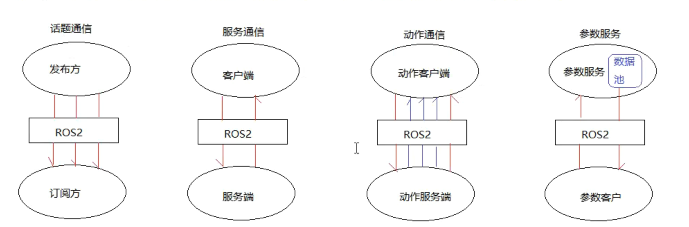

图：话题、服务、动作和参数四种通信方式的结构对比

参考：

1. 【ROS2理论与实践】[第 44 集：节点与话题](https://www.bilibili.com/video/BV1VB4y137ys/?p=44)
2. 【ROS2理论与实践】[第 45 集：ROS2 通信模型](https://www.bilibili.com/video/BV1VB4y137ys/?p=45)

# 三、自定义接口文件
ROS2 节点通信时，通信双方必须使用相同的数据结构。简单数据可以直接使用 ROS2 提供的标准接口；当标准接口不能满足需求时，可以在接口功能包中创建自定义接口。

本机的自定义接口统一保存在 `~/ws01/src/base_demo` 中。

## 3.1 msg 消息接口
`.msg` 文件用于定义话题通信中的消息结构。

文件位置：`~/ws01/src/base_demo/msg/Student.msg`

```plain
string name
int32 age
float64 height
```

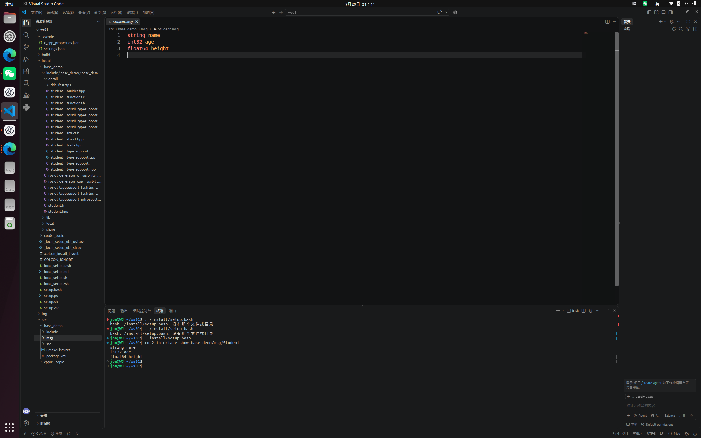

图：Student.msg 接口内容及编译生成结果

生成后，C++ 中使用：

```cpp
#include "base_demo/msg/student.hpp"
```

对应类型为：

```cpp
base_demo::msg::Student
```

## 3.2 srv 服务接口
`.srv` 文件用于服务通信，通过 `---` 分隔请求和响应。

文件位置：`~/ws01/src/base_demo/srv/Addints.srv`

```plain
int32 num1
int32 num2
---
int32 sum
```

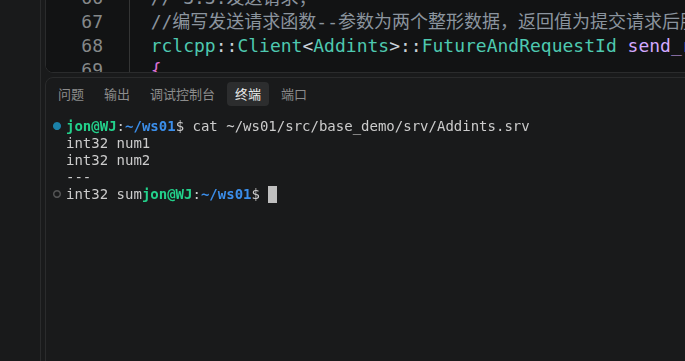

图：Addints.srv 接口文件的实际内容

上半部分是客户端发送的请求，下半部分是服务端返回的结果。

生成后，C++ 中使用：

```cpp
#include "base_demo/srv/addints.hpp"
```

对应类型为：

```cpp
base_demo::srv::Addints
```

这里需要注意大小写。本机实际文件名和接口名是 `Addints`，因此命令中不能写成 `AddInts`。

## 3.3 action 动作接口
`.action` 文件用于动作通信，通过两个 `---` 分隔目标、结果和反馈。

文件位置：`~/ws01/src/base_demo/action/Progress.action`

```plain
int32 num
---
int32 sum
---
float64 progress
```

三部分依次表示：

1. Goal：客户端发送的任务目标；
2. Result：任务结束后返回的最终结果；
3. Feedback：任务执行过程中连续返回的进度信息。

生成后，C++ 中使用：

```cpp
#include "base_demo/action/progress.hpp"
```

对应类型为：

```cpp
base_demo::action::Progress
```

## 3.4 常见字段类型
```plain
int8、int16、int32、int64
uint8、uint16、uint32、uint64
float32、float64
string
bool
```

时间和时长可以使用 ROS2 提供的消息类型：

```plain
builtin_interfaces/Time stamp
builtin_interfaces/Duration duration
```

参考：

1. 【ROS2理论与实践】[第 58 集：自定义消息接口](https://www.bilibili.com/video/BV1VB4y137ys/?p=58)
2. 【ROS2理论与实践】[第 69 集：自定义服务接口](https://www.bilibili.com/video/BV1VB4y137ys/?p=69)
3. 【ROS2理论与实践】[第 86 集：自定义动作接口](https://www.bilibili.com/video/BV1VB4y137ys/?p=86)

# 四、工作空间与接口功能包
本机使用的工作空间为 `~/ws01`，接口功能包为 `base_demo`。

## 4.1 当前目录结构
```plain
~/ws01/src/base_demo/
├── CMakeLists.txt
├── package.xml
├── msg/
│   └── Student.msg
├── srv/
│   └── Addints.srv
└── action/
    └── Progress.action
```

功能包只需要创建一次：

```bash
mkdir -p ~/ws01/src
cd ~/ws01/src
ros2 pkg create --build-type ament_cmake base_demo
```

## 4.2 package.xml 配置
在 `package.xml` 中配置接口生成与运行依赖，已经存在的条目不要重复添加：

```xml
<buildtool_depend>rosidl_default_generators</buildtool_depend>
<exec_depend>rosidl_default_runtime</exec_depend>
<depend>action_msgs</depend>
<member_of_group>rosidl_interface_packages</member_of_group>
```

## 4.3 CMakeLists.txt 配置
在 `ament_package()` 之前添加接口生成配置：

```cmake
find_package(rosidl_default_generators REQUIRED)

rosidl_generate_interfaces(${PROJECT_NAME}
  "msg/Student.msg"
  "srv/Addints.srv"
  "action/Progress.action"
)

ament_export_dependencies(rosidl_default_runtime)
```

## 4.4 编译并检查接口
应该在工作空间根目录编译：

```bash
cd ~/ws01
colcon build --packages-select base_demo
source install/setup.bash
```

检查生成结果：

```bash
ros2 interface show base_demo/msg/Student
ros2 interface show base_demo/srv/Addints
ros2 interface show base_demo/action/Progress
```

只有接口文件已经创建、写入 `CMakeLists.txt` 并成功编译后，查询命令才会正常输出。

# 五、话题通信
话题通信由发布方和订阅方组成。发布方持续发布消息，订阅方通过回调函数接收和处理消息。

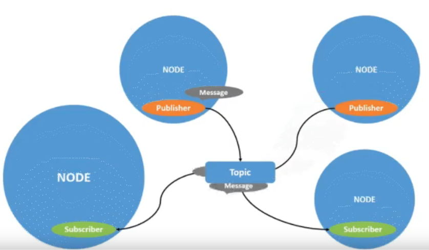

图：话题通信中的发布方、话题与订阅方

本机功能包：`cpp01_topic`

## 5.1 创建功能包
以下命令只需要执行一次：

```bash
cd ~/ws01/src
ros2 pkg create cpp01_topic --build-type ament_cmake \
  --dependencies rclcpp std_msgs base_demo
```

## 5.2 当前程序
| 可执行程序 | 作用 |
| --- | --- |
| `demo01_talker` | 使用标准消息发布数据 |
| `demo02_listener` | 订阅标准消息 |
| `demo03_talker` | 发布自定义 `Student`<br/> 消息 |
| `demo04_listener` | 订阅自定义 `Student`<br/> 消息 |


### 标准消息初步练习
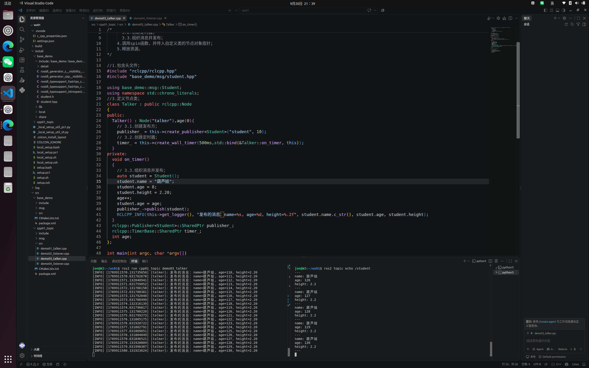

图：使用命令行测试话题发布方

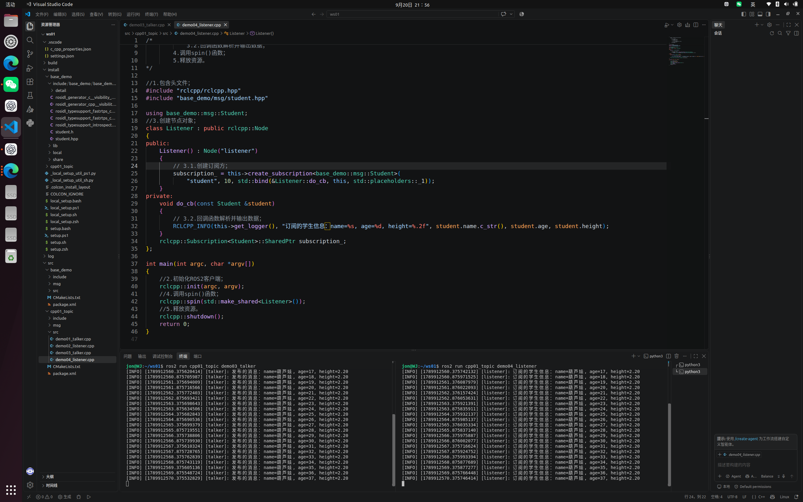

图：发布方持续发送消息

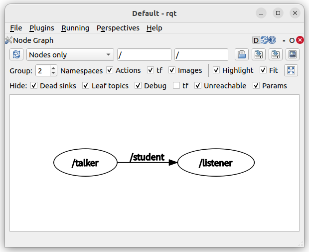

图：使用 rqt_graph 查看节点与话题的连接关系

## 5.3 编译与运行
```bash
cd ~/ws01
colcon build --packages-select cpp01_topic
source install/setup.bash
```

分别在两个终端中运行发布方和订阅方：

```bash
ros2 run cpp01_topic demo03_talker
```

```bash
ros2 run cpp01_topic demo04_listener
```

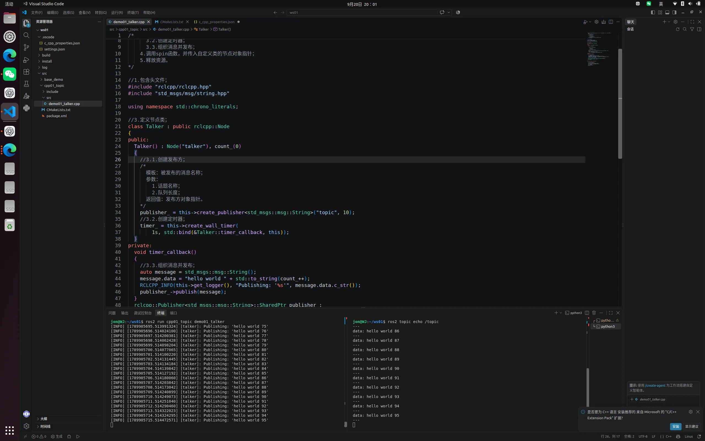

图：自定义 Student 消息发布方运行结果

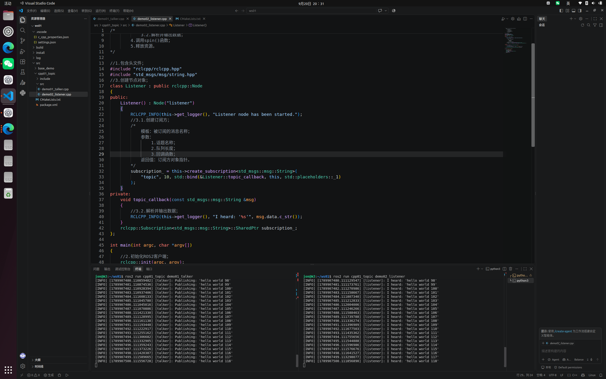

图：发布方与订阅方同时运行的通信结果

## 5.4 话题查询命令
```bash
ros2 topic list
ros2 topic type /student
ros2 topic info /student
ros2 topic echo /student
ros2 topic hz /student
```

手动发布自定义消息：

```bash
ros2 topic pub --once /student base_demo/msg/Student \
  "{name: 'jon', age: 18, height: 1.75}"
```

还可以使用 `rqt_graph` 观察发布方、订阅方和话题之间的连接关系：

```bash
rqt_graph
```

参考：

1. 【ROS2理论与实践】[第 48 集：话题通信概念](https://www.bilibili.com/video/BV1VB4y137ys/?p=48)
2. 【ROS2理论与实践】[第 49 集：话题通信案例分析](https://www.bilibili.com/video/BV1VB4y137ys/?p=49)
3. 【ROS2理论与实践】[第 50—54 集：C++ 发布方与订阅方](https://www.bilibili.com/video/BV1VB4y137ys/?p=50)
4. 【ROS2理论与实践】[第 58—61 集：自定义消息通信](https://www.bilibili.com/video/BV1VB4y137ys/?p=58)
5. 【ROS2理论与实践】[第 65 集：rqt_graph](https://www.bilibili.com/video/BV1VB4y137ys/?p=65)

# 六、服务通信
服务通信由服务端和客户端组成。客户端发送一次请求，服务端处理后返回一次响应，适合有明确结果的一次性任务。

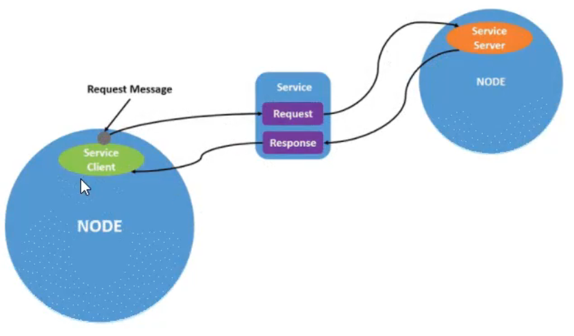

图：服务客户端发出请求、服务端处理并返回响应

本机功能包：`cpp02_service`

## 6.1 当前程序
| 可执行程序 | 作用 |
| --- | --- |
| `demo01_server` | 创建 `/addints`<br/> 服务并计算两个整数之和 |
| `demo02_client` | 向服务端发送两个整数并接收结果 |


## 6.2 编译与运行
```bash
cd ~/ws01
colcon build --packages-select cpp02_service
source install/setup.bash
```

启动服务端：

```bash
ros2 run cpp02_service demo01_server
```

在另一个终端中运行客户端：

```bash
ros2 run cpp02_service demo02_client 10 40
```

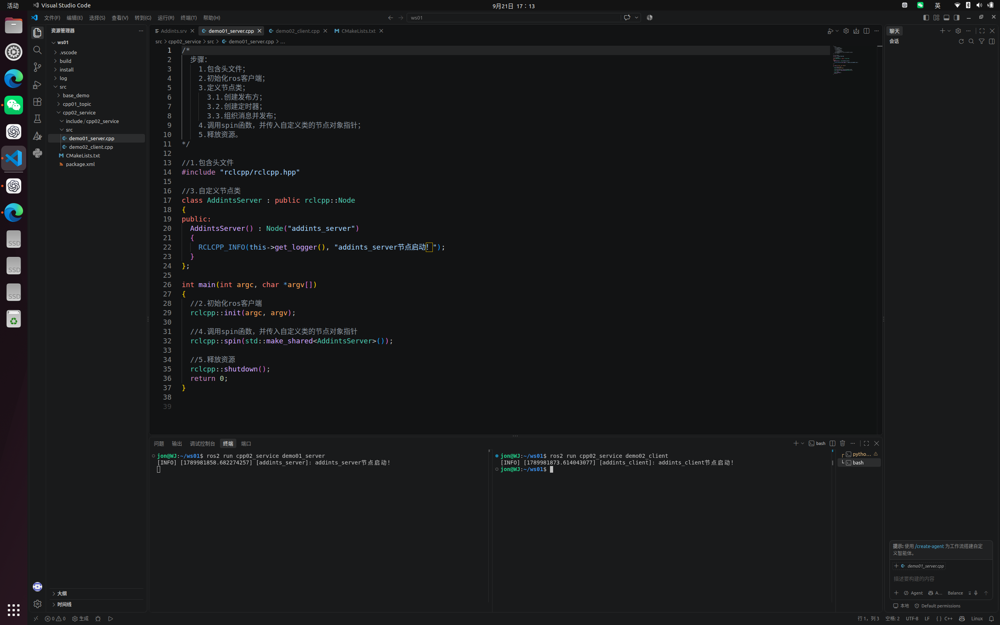

图：服务端与客户端初步通信结果

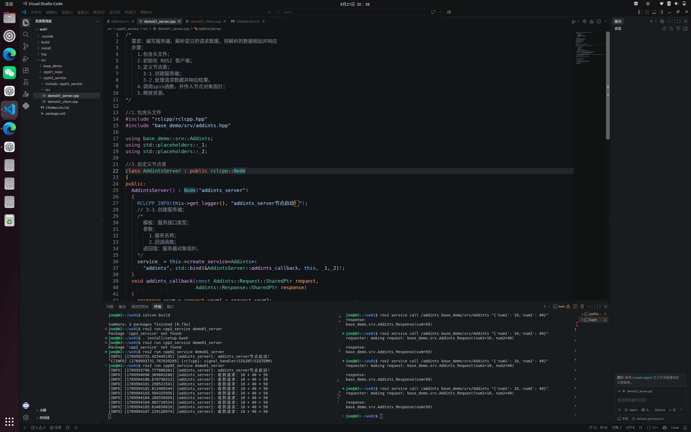

图：使用图形化服务插件发送请求

也可以通过命令行直接调用服务：

```bash
ros2 service call /addints base_demo/srv/Addints \
  "{num1: 10, num2: 40}"
```

预期结果中的 `sum` 为 `50`。

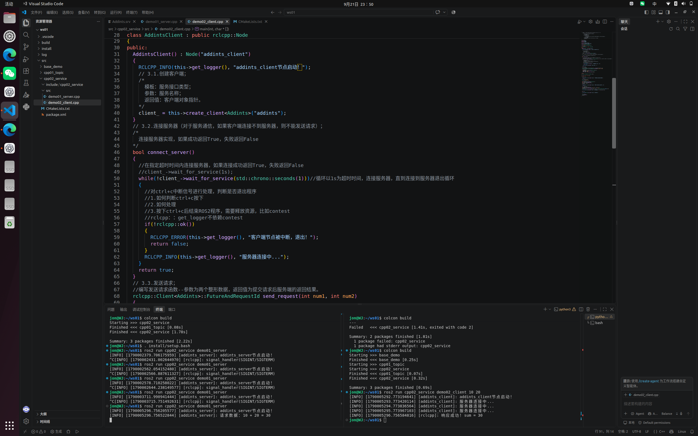

图：Addints 服务的请求与响应结果

## 6.3 服务查询命令
```bash
ros2 service list
ros2 service type /addints
ros2 service info /addints
ros2 interface show base_demo/srv/Addints
```

参考：

1. 【ROS2理论与实践】[第 67 集：服务通信概念](https://www.bilibili.com/video/BV1VB4y137ys/?p=67)
2. 【ROS2理论与实践】[第 68—69 集：案例分析与接口定义](https://www.bilibili.com/video/BV1VB4y137ys/?p=68)
3. 【ROS2理论与实践】[第 70—77 集：C++ 服务端与客户端](https://www.bilibili.com/video/BV1VB4y137ys/?p=70)

# 七、动作通信
动作通信适合耗时较长、需要持续反馈进度或允许取消的任务。动作客户端发送目标，动作服务端处理目标并持续返回反馈，任务结束后再返回结果。

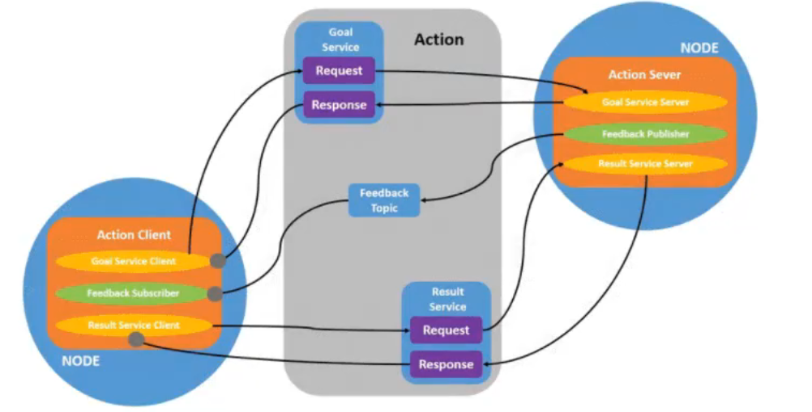

图：动作通信包含目标、连续反馈和最终结果

本机功能包：`cpp03_action`

## 7.1 当前程序
| 可执行程序 | 作用 |
| --- | --- |
| `demo01_server` | 接收目标、计算累加和并反馈进度 |
| `demo02_client` | 发送目标、接收反馈和最终结果 |


动作名称为 `/get_sum`，接口类型为 `base_demo/action/Progress`。

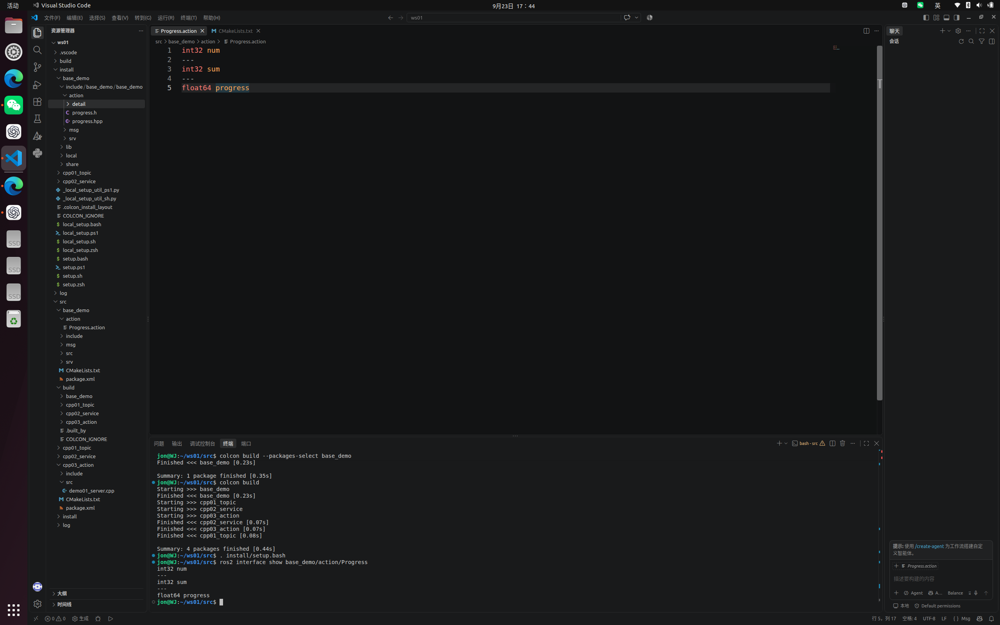

图：动作接口与 cpp03_action 功能包搭建结果

## 7.2 动作服务端的三个回调
1. `handle_goal`：决定是否接收目标；
2. `handle_cancel`：决定是否允许取消任务；
3. `handle_accepted`：目标被接收后开始执行任务。

`uuid` 是 ROS2 为每个动作目标生成的唯一标识，可用于区分同时提交的多个目标。如果当前程序不使用它，可以在回调函数中写：

```cpp
(void)uuid;
```

这里的变量名必须与函数参数名完全一致。

## 7.3 编译与运行
```bash
cd ~/ws01
colcon build --packages-select cpp03_action
source install/setup.bash
```

启动服务端：

```bash
ros2 run cpp03_action demo01_server
```

在另一个终端中发送目标，并显示反馈：

```bash
ros2 action send_goal /get_sum base_demo/action/Progress \
  "{num: 10}" --feedback
```

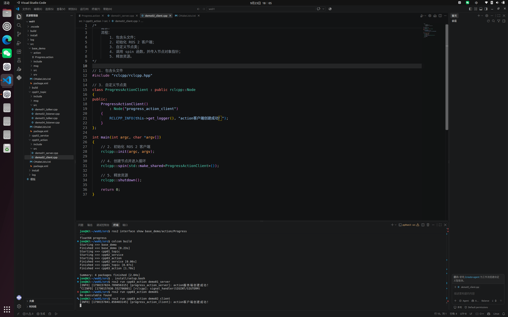

图：动作服务端初始模板编译与运行结果

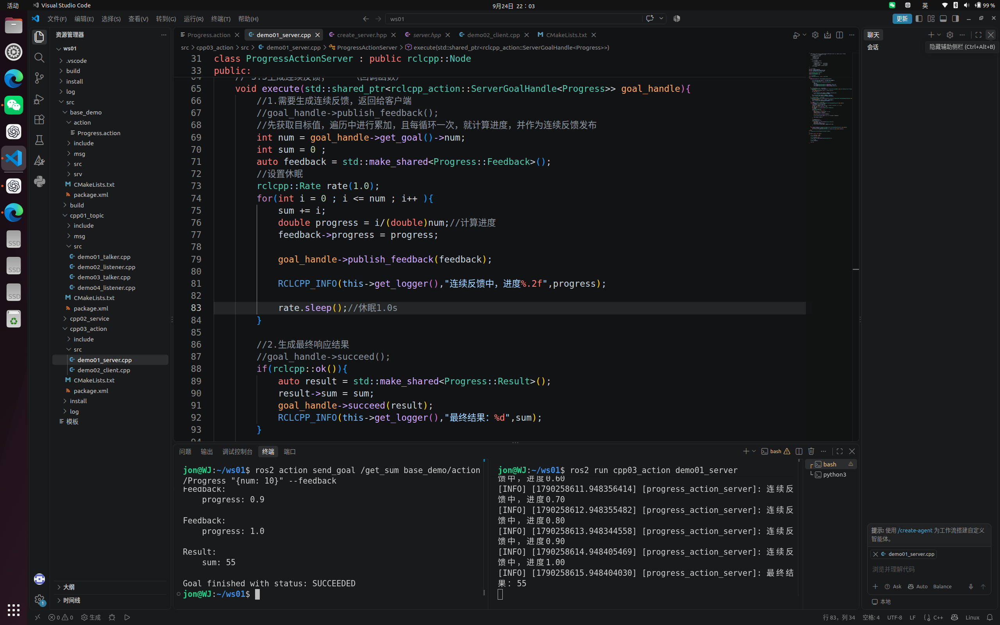

图：动作服务端接收客户端目标

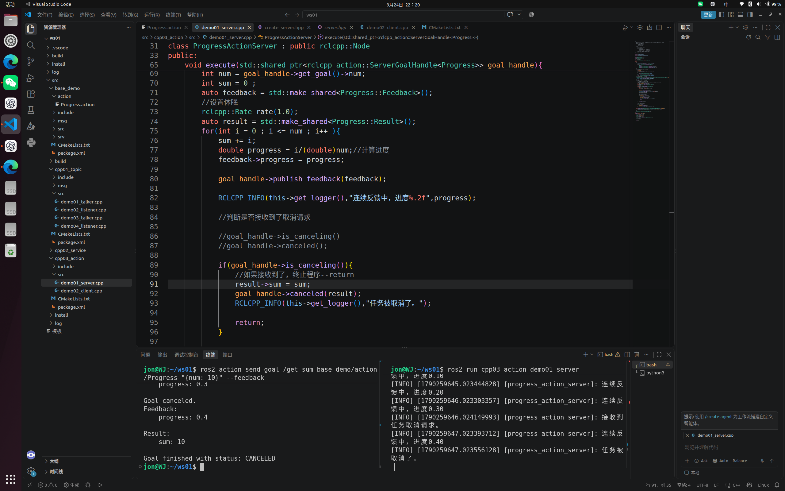

图：动作任务取消请求测试

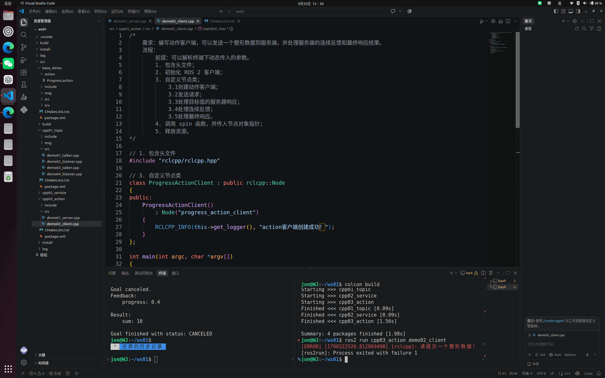

图：动作客户端检查服务端并发送目标

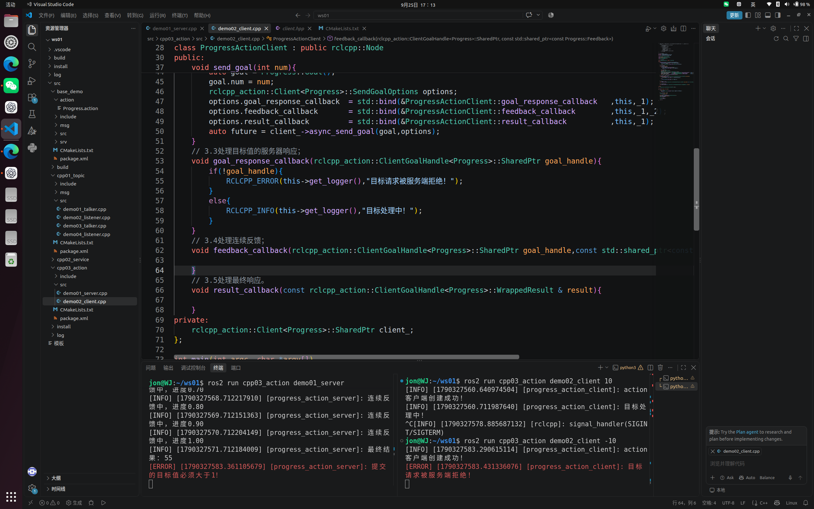

图：动作客户端接收 Feedback 数据

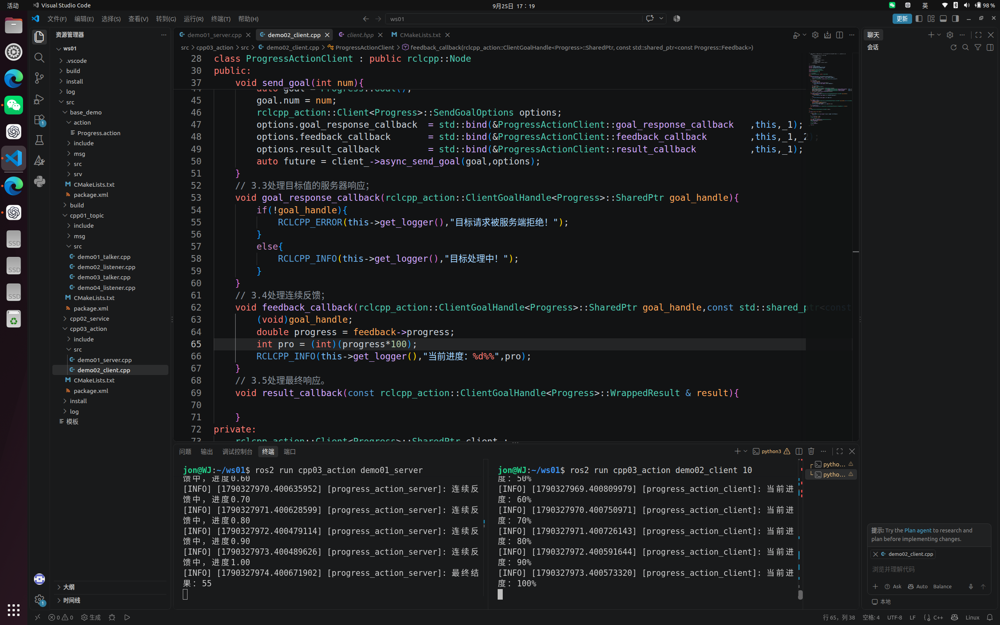

图：动作服务端执行任务并更新进度

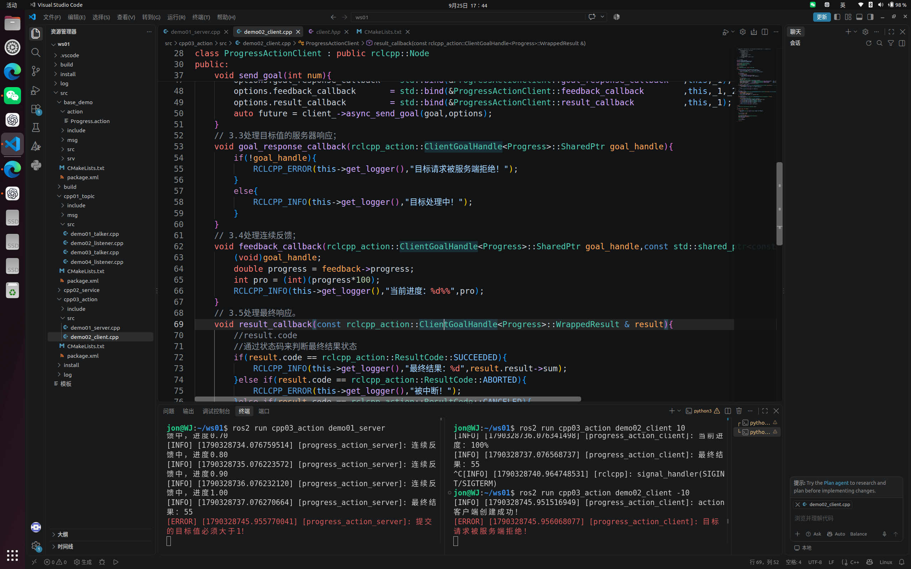

图：动作通信返回连续反馈和最终结果

当目标为 `10` 时，如果计算的是 `1 + 2 + ... + 10`，最终结果应该为 `55`。如果结果为 `11`，说明循环中可能一直执行 `sum += 1`，应改为累加当前循环变量。

## 7.4 动作查询命令
```bash
ros2 action list
ros2 action type /get_sum
ros2 action info /get_sum
ros2 interface show base_demo/action/Progress
```

参考：

1. 【ROS2理论与实践】[第 84 集：动作通信概念](https://www.bilibili.com/video/BV1VB4y137ys/?p=84)
2. 【ROS2理论与实践】[第 85—86 集：案例分析与动作接口](https://www.bilibili.com/video/BV1VB4y137ys/?p=85)
3. 【ROS2理论与实践】[第 87—94 集：C++ 动作服务端](https://www.bilibili.com/video/BV1VB4y137ys/?p=87)
4. 【ROS2理论与实践】[第 95—100 集：C++ 动作客户端](https://www.bilibili.com/video/BV1VB4y137ys/?p=95)

# 八、参数服务
参数是节点运行时可以读取和修改的配置数据。参数由具体节点管理，常用于保存机器人名称、尺寸、速度上限和算法阈值等信息。

本机功能包：`cpp04_param`

## 8.1 当前程序
| 可执行程序 | 作用 |
| --- | --- |
| `demo00_param` | 参数 API 基础练习 |
| `demo01_sever` | 创建参数服务端并管理参数 |
| `demo02_client` | 通过参数客户端查询和修改参数 |


注意：当前可执行文件实际名称为 `demo01_sever`，其中 `server` 少写了一个 `r`，运行时必须使用 CMakeLists.txt 中配置的真实名称。

## 8.2 参数的基本操作
声明参数：

```cpp
this->declare_parameter("car_name", "mouse");
this->declare_parameter("width", 3.0);
this->declare_parameter("wheels", 5);
```

查询参数：

```cpp
this->get_parameter("car_name");
this->has_parameter("length");
```

修改参数：

```cpp
this->set_parameter(rclcpp::Parameter("width", 4.0));
```

删除参数：

```cpp
this->undeclare_parameter("length");
```

如果第一次查询时就发现 `length` 已经存在，通常说明它在节点构造函数或查询函数之前已经通过 `declare_parameter()` 声明，而不是参数被永久保存在系统中。每次运行程序都会重新创建节点并重新执行代码。

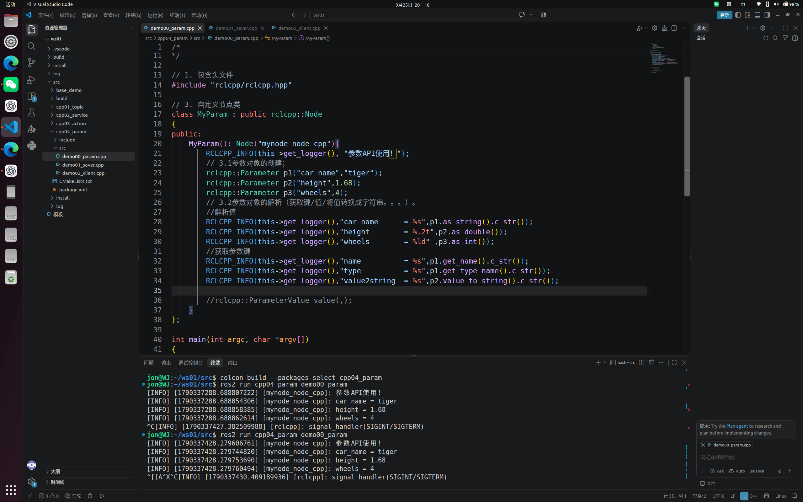

图：参数声明、查询和修改 API 测试

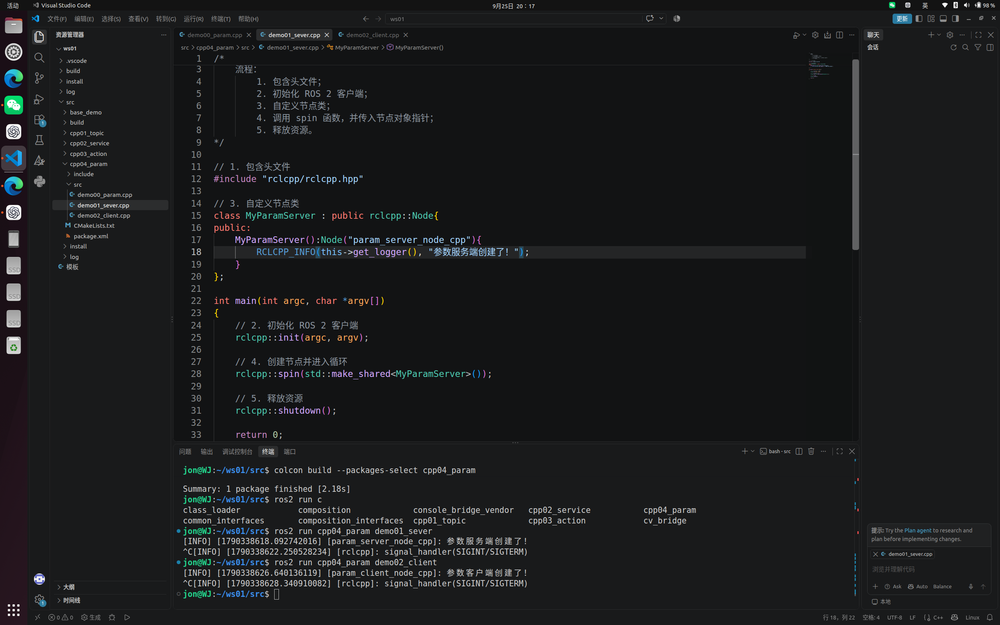

图：参数客户端与服务端初步运行结果

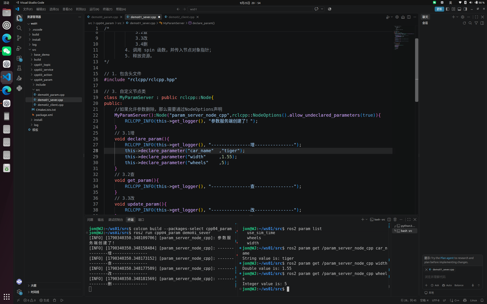

图：参数服务端添加参数功能的实现结果

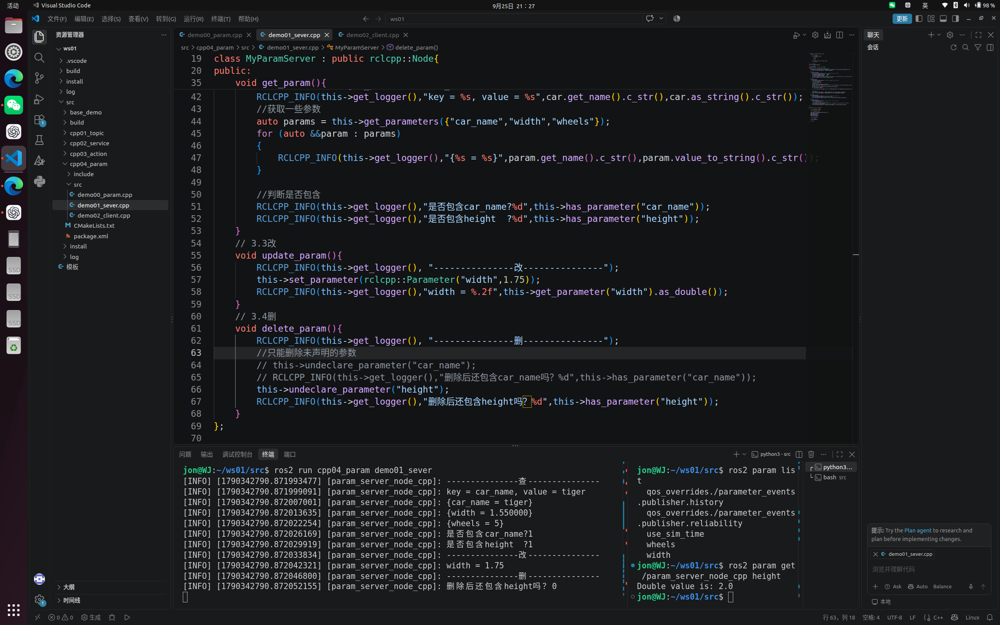

图：参数查询、修改和删除功能的运行结果

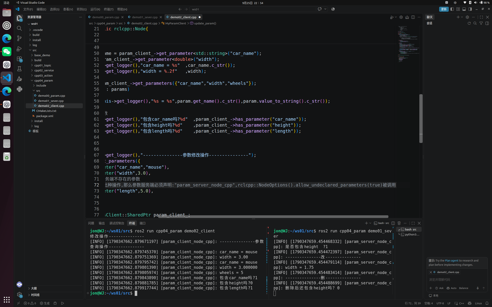

图：参数客户端与服务端完整通信结果

## 8.3 参数命令
```bash
ros2 param list
ros2 param get /param_server_node_cpp car_name
ros2 param set /param_server_node_cpp width 4.0
ros2 param describe /param_server_node_cpp width
ros2 param dump /param_server_node_cpp
```

参考：

1. 【ROS2理论与实践】[第 111 集：参数服务概念](https://www.bilibili.com/video/BV1VB4y137ys/?p=111)
2. 【ROS2理论与实践】[第 112—114 集：案例分析与 C++ 参数 API](https://www.bilibili.com/video/BV1VB4y137ys/?p=112)
3. 【ROS2理论与实践】[第 116—121 集：C++ 参数服务端](https://www.bilibili.com/video/BV1VB4y137ys/?p=116)
4. 【ROS2理论与实践】[第 122—124 集：C++ 参数客户端](https://www.bilibili.com/video/BV1VB4y137ys/?p=122)

# 九、常用通信查询命令
## 9.1 查询正在运行的节点
```bash
ros2 node list
ros2 node info <节点名称>
```

## 9.2 查询接口
```bash
ros2 interface list
ros2 interface show base_demo/msg/Student
ros2 interface show base_demo/srv/Addints
ros2 interface show base_demo/action/Progress
```

## 9.3 查询通信状态
```bash
ros2 topic list
ros2 service list
ros2 action list
ros2 param list
```

当程序能够成功编译但通信没有结果时，可以先使用这些命令确认节点、通信名称和接口类型是否正确。

# 十、通信方式选择
| 需求 | 推荐方式 | 原因 |
| --- | --- | --- |
| 持续发送传感器数据 | Topic | 异步、持续、支持一对多 |
| 发出请求并立即获得结果 | Service | 请求和响应关系明确 |
| 执行长时间任务并观察进度 | Action | 支持反馈、结果和取消 |
| 修改节点运行配置 | Parameter | 适合保存和动态调整配置 |


选择通信方式时，不能只看能否传递数据，还需要考虑是否需要响应、进度、取消以及数据是否持续产生。

# 十一、标准编译与运行流程
每次修改 C++ 源文件、`CMakeLists.txt`、`package.xml` 或接口文件后，都需要重新编译。

```bash
cd ~/ws01
colcon build --packages-select <功能包名称>
source install/setup.bash
ros2 run <功能包名称> <可执行程序名称>
```

例如：

```bash
cd ~/ws01
colcon build --packages-select cpp02_service
source install/setup.bash
ros2 run cpp02_service demo01_server
```

注意事项：

1. 参数是 `--packages-select`，不是 `--package-select`；
2. `source install/setup.bash` 中的 `install` 是当前工作空间下的相对路径，不能写成 `/install/setup.bash`；
3. 接口功能包发生变化时，应先成功编译 `base_demo`，再编译依赖它的功能包；
4. 新终端需要重新加载环境，除非已经在 `~/.bashrc` 中配置自动加载；
5. 推荐始终在 `~/ws01` 目录执行 `colcon build`，避免在 `src` 中生成另一套 `build`、`install` 和 `log` 目录。

# 十二、学习过程中遇到的问题
## 12.1 自定义接口头文件报红或找不到
首先确认接口功能包已经成功编译并加载：

```bash
cd ~/ws01
colcon build --packages-select base_demo
source install/setup.bash
```

然后检查源文件中的头文件名称是否与实际接口一致：

```cpp
#include "base_demo/msg/student.hpp"
#include "base_demo/srv/addints.hpp"
#include "base_demo/action/progress.hpp"
```

还需要在通信功能包的 `package.xml` 和 `CMakeLists.txt` 中正确添加 `base_demo` 依赖。

## 12.2 服务类型无效
错误命令中曾使用 `base_demo/srv/AddInts`，但本机真实类型是：

```plain
base_demo/srv/Addints
```

ROS2 的接口名称区分大小写，可以先执行以下命令确认：

```bash
ros2 interface list | grep Add
```

## 12.3 编译成功但找不到可执行程序
先检查 `CMakeLists.txt` 中是否已经使用 `add_executable()` 创建目标，并通过 `install(TARGETS ...)` 安装；然后重新编译并加载环境。

```bash
ros2 pkg executables cpp02_service
```

该命令可以直接查看功能包中已安装的可执行程序名称。

## 12.4 动作客户端一直等待服务端
如果显示 `Waiting for an action server to become available...`，应检查：

1. 动作服务端是否正在另一个终端中运行；
2. 客户端和服务端的动作名称是否都为 `/get_sum`；
3. 两个终端是否都加载了 `~/ws01/install/setup.bash`；
4. 接口类型是否均为 `base_demo/action/Progress`。

## 12.5 同名节点警告
出现 `Publisher already registered for provided node name`，通常表示程序中创建了两个名称完全相同的节点对象。应检查 `main()` 中是否又额外创建了一次客户端节点，并确保只对需要的节点调用 `spin()`。

# 十三、本章总结
通过本阶段学习，我理解了 ROS2 节点之间常用的四种通信方式，并完成了话题、服务、动作和参数的 C++ 实践。话题适合持续传输数据，服务适合一次请求与响应，动作适合耗时任务和进度反馈，参数适合管理节点运行配置。

在实际练习中，我还掌握了自定义 `msg`、`srv` 和 `action` 接口的创建与配置方法，并能够使用 `colcon build`、`source install/setup.bash` 和 ROS2 命令行工具完成编译、运行与故障排查。后续学习中，应继续关注接口名称、大小写、依赖配置、可执行程序安装以及不同终端中的环境加载状态。
