# ROS 2 通信机制补充学习

学习资料：[ROS2 Tuition 第三章](https://rzl6.github.io/ROS2_Tuition/di-3-zhang-ros2-tong-xin-ji-zhi-bu-chong/31-fen-bu-shi.html)  
实践环境：Ubuntu 22.04.5 LTS + ROS 2 Humble  
工作空间：`~/ws01`  
主要功能包：`base_demo`、`cpp01_topic`、`cpp02_service`、`cpp03_action`、`cpp04_param`、`cpp05_names`、`cpp06_time`、`cpp07_exercise`、`turtlesim` 和 `tutorails_plumbing`。  
编程方式：功能节点主要使用 C++，Launch 文件同时练习 Python、XML 和 YAML。

## 一、学习目标

本阶段在话题、服务、动作和参数通信的基础上，进一步学习 ROS 2 的分布式通信、工作空间组织、名称重映射、时间 API、命令行工具以及综合通信练习。

1. 理解 DDS 分布式发现机制和 `ROS_DOMAIN_ID` 的作用；
2. 理解工作空间覆盖、功能包重名和环境加载顺序；
3. 掌握节点名称、命名空间以及全局、相对、私有话题；
4. 能够使用命令行、C++ 代码以及 Python、XML、YAML Launch 完成名称配置和重映射；
5. 掌握 `rclcpp::Rate`、`rclcpp::Time` 与 `rclcpp::Duration`；
6. 熟悉 ROS 2 命令行、rqt 和 turtlesim 综合通信练习。

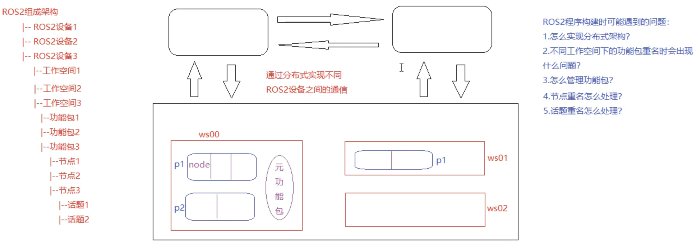

图：本阶段知识结构

**学习资料：**

1. [【ROS2理论与实践】第 133 集：ROS 2 通信机制补充引言](https://www.bilibili.com/video/BV1VB4y137ys/?p=133)

## 二、ROS 2 分布式通信

### 2.1 分布式通信概念

ROS 2 基于 DDS 实现分布式通信。同一网络中的节点可以自动发现彼此，不需要像 ROS 1 一样依赖统一的 Master。实际项目中可以让个人电脑负责开发和监控，让机器人小电脑分别运行视觉、定位、导航或底盘节点。

多机通信需要满足：设备网络互通、`ROS_DOMAIN_ID` 一致、防火墙未阻止 DDS 数据，并且网络允许组播或对应的发现方式。

### 2.2 ROS_DOMAIN_ID

`ROS_DOMAIN_ID` 用于划分通信域。同一域中的节点可以互相发现，不同域中的节点默认隔离。未设置时通常使用 0。

```bash
echo $ROS_DOMAIN_ID
export ROS_DOMAIN_ID=6
```

临时设置只对当前终端有效。如需长期使用，可将 `export ROS_DOMAIN_ID=6` 写入 `~/.bashrc`。两台需要通信的设备必须使用相同的域 ID，一般建议选用 0～101 范围内的值。

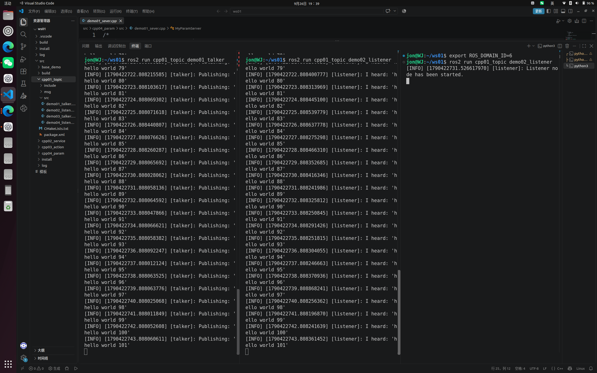

图：不同 ROS_DOMAIN_ID 下的通信隔离演示

### 2.3 多机通信测试

先用 `ping 对方IP` 检查网络，再让一台设备发布、另一台设备订阅：

设备 A：

```bash
ros2 topic pub /chatter std_msgs/msg/String "{data: hello}" -r 1
```

设备 B：

```bash
ros2 topic echo /chatter
```

如果设备 B 能持续收到 `hello`，说明网络、域 ID 和 DDS 发现均工作正常。

**学习资料：**

1. [【ROS2理论与实践】第 134 集：分布式通信的场景、概念与作用](https://www.bilibili.com/video/BV1VB4y137ys/?p=134)
2. [【ROS2理论与实践】第 135 集：分布式通信实现](https://www.bilibili.com/video/BV1VB4y137ys/?p=135)
3. [【ROS2理论与实践】第 136 集：DDS 域 ID 计算规则](https://www.bilibili.com/video/BV1VB4y137ys/?p=136)
4. [【ROS2理论与实践】第 137 集：分布式通信小结](https://www.bilibili.com/video/BV1VB4y137ys/?p=137)

## 三、工作空间覆盖

### 3.1 覆盖关系与风险

不同工作空间可以存在同名功能包。多个工作空间被依次加载时，后加载的工作空间会覆盖先加载工作空间中的同名包，这就是工作空间覆盖。

```bash
echo $AMENT_PREFIX_PATH
ros2 pkg prefix base_demo
```

`ros2 pkg prefix` 可以确认当前实际使用的功能包来自哪里。覆盖使用不当时，可能出现运行的不是预期版本、编译与运行使用不同版本、头文件顺序混乱等问题。

### 3.2 本机正确编译方式

本机工作空间根目录是 `~/ws01`。必须在根目录编译，而不是在 `~/ws01/src` 中编译：

```bash
cd ~/ws01
colcon build

# 或只编译指定功能包

colcon build --packages-select cpp05_names
```

在 `src` 中执行 `colcon build` 会把 `build`、`install` 和 `log` 错误生成到源码目录。本机目前就存在这组历史目录，后续应固定回到 `~/ws01` 编译。

如果当前终端已经加载过同一个工作空间，重编译接口包时可能看到 underlay/overlay 覆盖警告。优先在新终端中编译；只有明确理解 ABI/API 风险时才使用 `--allow-overriding`。

**学习资料：**

1. [【ROS2理论与实践】第 138 集：工作空间覆盖的场景、概念与作用](https://www.bilibili.com/video/BV1VB4y137ys/?p=138)
2. [【ROS2理论与实践】第 139 集：工作空间覆盖演示](https://www.bilibili.com/video/BV1VB4y137ys/?p=139)
3. [【ROS2理论与实践】第 140 集：工作空间覆盖的原因和隐患](https://www.bilibili.com/video/BV1VB4y137ys/?p=140)

## 四、元功能包

### 4.1 作用与本机配置

元功能包（Metapackage）通常不包含节点代码，而是用依赖关系把一组功能包组织起来，便于统一安装、部署和管理。本机已有元功能包 `tutorails_plumbing`（名称以当前工程实际拼写为准）。

其 `package.xml` 可以使用 `exec_depend` 统一依赖 `base_demo`、`cpp01_topic`、`cpp02_service`、`cpp03_action`、`cpp04_param`、`cpp05_names`、`cpp06_time` 和 `cpp07_exercise`。

```bash
cd ~/ws01
colcon build --packages-select tutorails_plumbing
```

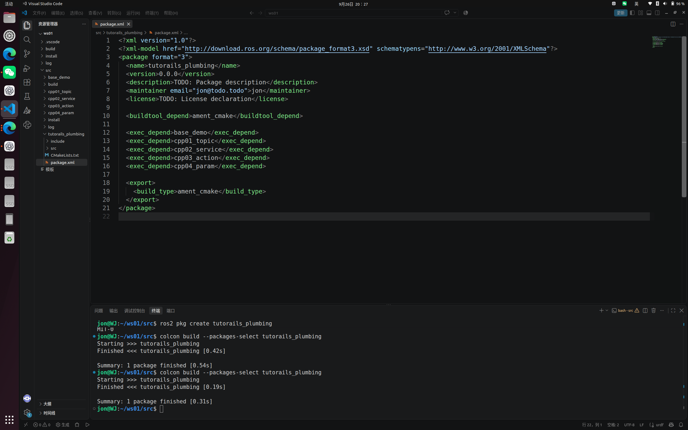

图：元功能包的依赖组织与实现

**学习资料：**

1. [【ROS2理论与实践】第 141 集：元功能包的场景、概念与作用](https://www.bilibili.com/video/BV1VB4y137ys/?p=141)
2. [【ROS2理论与实践】第 142 集：元功能包实现](https://www.bilibili.com/video/BV1VB4y137ys/?p=142)

## 五、节点名称与命名空间

### 5.1 节点重名与命令行重映射

ROS 2 允许多个节点使用相同名称，但重名会使日志、参数和节点管理变得混乱。可以通过命名空间或 `__node` 重映射解决：

```bash
ros2 node list
ros2 node info /talker
ros2 run cpp01_topic demo01_talker --ros-args -r __ns:=/robot1
ros2 run cpp01_topic demo01_talker --ros-args -r __node:=student_talker
ros2 run cpp01_topic demo01_talker --ros-args -r __ns:=/robot1 -r __node:=student_talker
```

最后一条命令生成的完整节点名称为 `/robot1/student_talker`。

### 5.2 C++ 与 Launch 配置

本机 `cpp05_names/src/demo01_names.cpp` 在构造函数中使用 `Node("wang", "jon")`，节点名称为 `wang`，命名空间为 `/jon`。

`cpp05_names/launch` 目录包含三种 Launch 写法：

+ `demo01_names_launch.py`：Python Launch；
+ `demo02_names_launch.xml`：XML Launch；
+ `demo03_names_launch.yaml`：YAML Launch。

```bash
cd ~/ws01
colcon build --packages-select cpp05_names
ros2 launch cpp05_names demo01_names_launch.py
ros2 launch cpp05_names demo02_names_launch.xml
ros2 launch cpp05_names demo03_names_launch.yaml
```

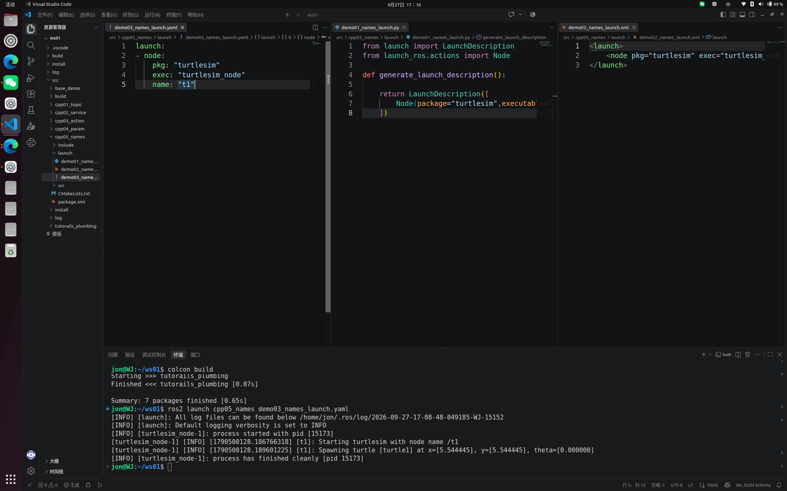

图：Python、XML、YAML 三种 Launch 配置

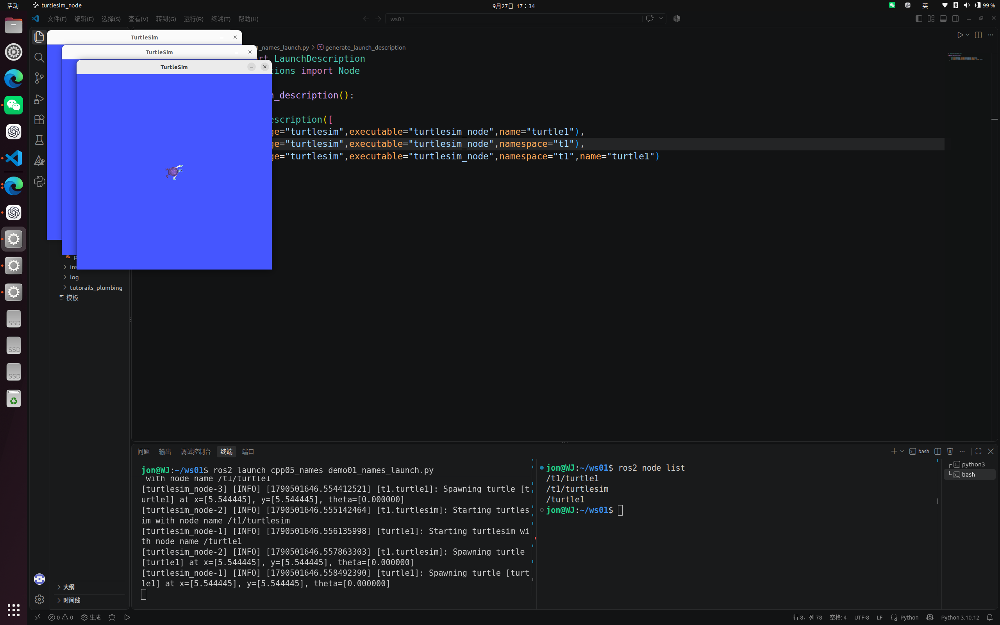

图：Python Launch 解决节点重名

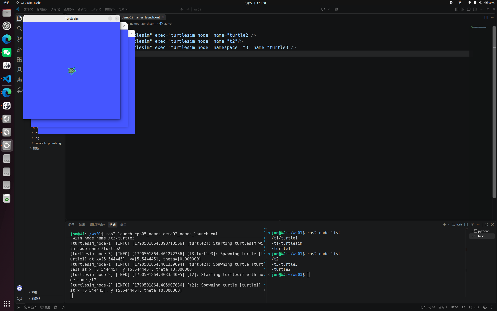

图：XML Launch 解决节点重名

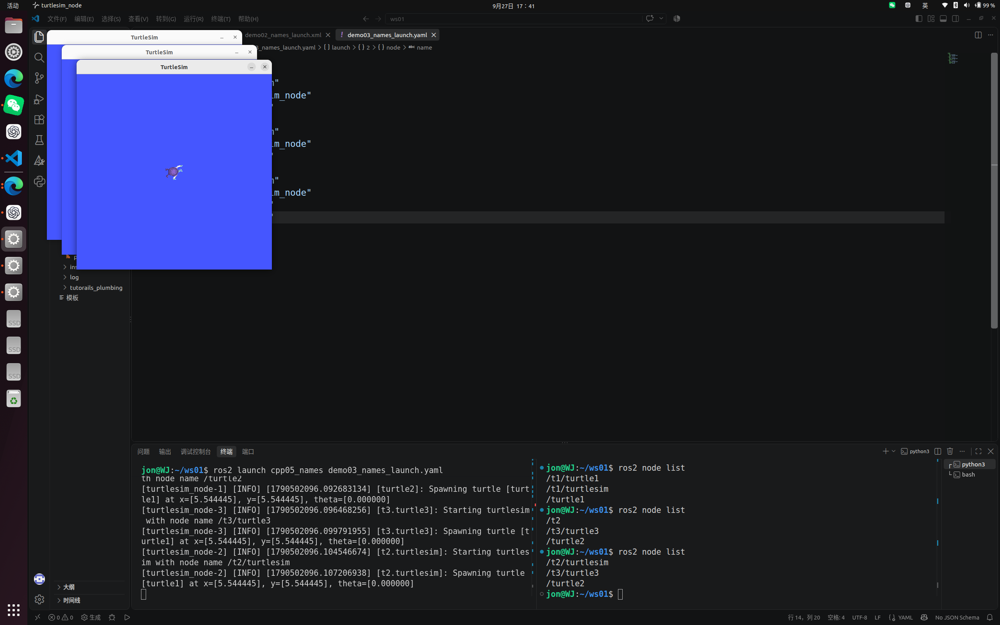

图：YAML Launch 解决节点重名

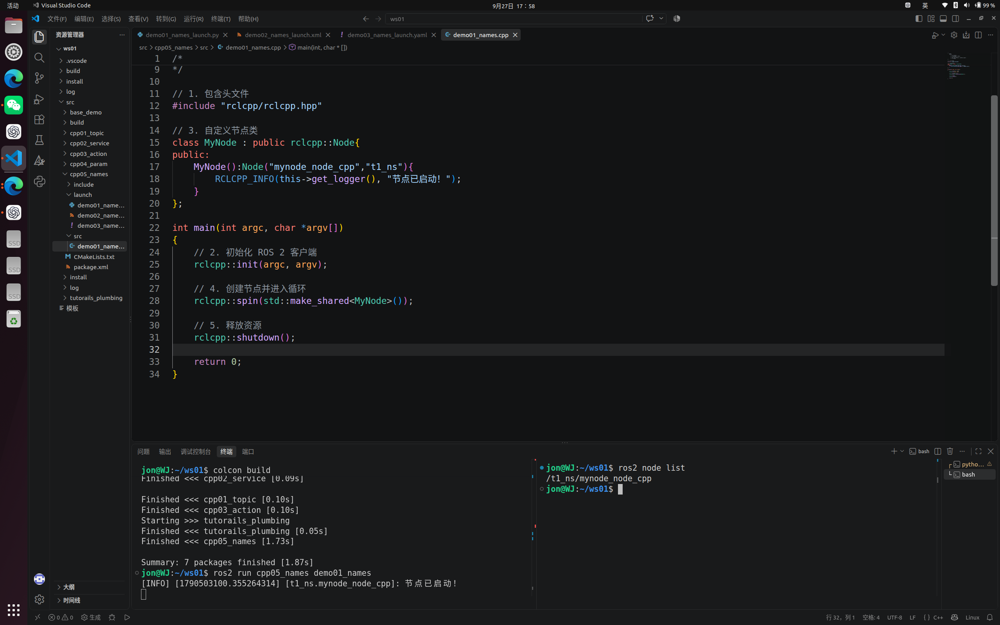

图：在 C++ 编码中设置节点名称和命名空间

**学习资料：**

1. [【ROS2理论与实践】第 143 集：节点重名问题与解决方案](https://www.bilibili.com/video/BV1VB4y137ys/?p=143)
2. [【ROS2理论与实践】第 144 集：使用 ros2 run 解决节点重名](https://www.bilibili.com/video/BV1VB4y137ys/?p=144)
3. [【ROS2理论与实践】第 145 集：使用 Launch 解决节点重名——Launch 简介](https://www.bilibili.com/video/BV1VB4y137ys/?p=145)
4. [【ROS2理论与实践】第 146 集：使用 Python Launch 解决节点重名](https://www.bilibili.com/video/BV1VB4y137ys/?p=146)
5. [【ROS2理论与实践】第 147 集：通过编码设置节点名称](https://www.bilibili.com/video/BV1VB4y137ys/?p=147)

## 六、话题名称与重映射

### 6.1 三种话题名称

+ **全局话题**：以 `/` 开头，例如 `/one`，不受节点名称和命名空间影响；
+ **相对话题**：不以 `/` 开头，例如 `yi`。若命名空间为 `/jon`，最终名称为 `/jon/yi`；
+ **私有话题**：以 `~/` 开头，例如 `~/vip`。本机节点 `/jon/wang` 对应的话题为 `/jon/wang/vip`。

本机 `demo01_names.cpp` 当前启用的是私有话题：

`pub_ = this->create_publisher<std_msgs::msg::String>("~/vip", 10);`

### 6.2 命令行和 Launch 重映射

`cpp01_topic` 的原生字符串发布者和订阅者使用话题 `topic`。临时重映射时，两端必须指向同一个新名称：

```bash
ros2 run cpp01_topic demo01_talker --ros-args -r topic:=chatter
ros2 run cpp01_topic demo02_listener --ros-args -r topic:=chatter
```

本机三种 Launch 文件都演示了 turtlesim 话题重映射。例如 Python Launch 将第二个节点的 `/turtle1/cmd_vel` 映射为 `/cmd_vel`。

```python
Node(
    package="turtlesim",
    executable="turtlesim_node",
    remappings=[("/turtle1/cmd_vel", "/cmd_vel")],
)
```

Launch 目录必须在 `CMakeLists.txt` 中安装，否则编译后 `ros2 launch` 找不到文件：

```cmake
install(
  DIRECTORY launch
  DESTINATION share/${PROJECT_NAME}
)
```

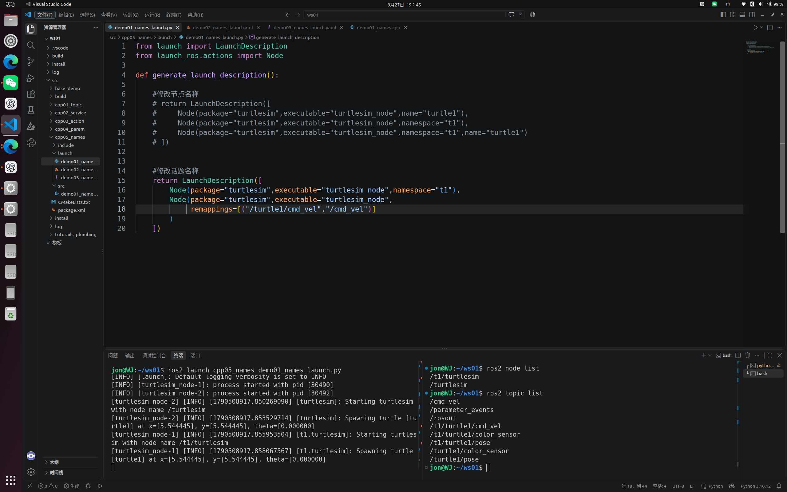

图：Python Launch 实现话题重映射

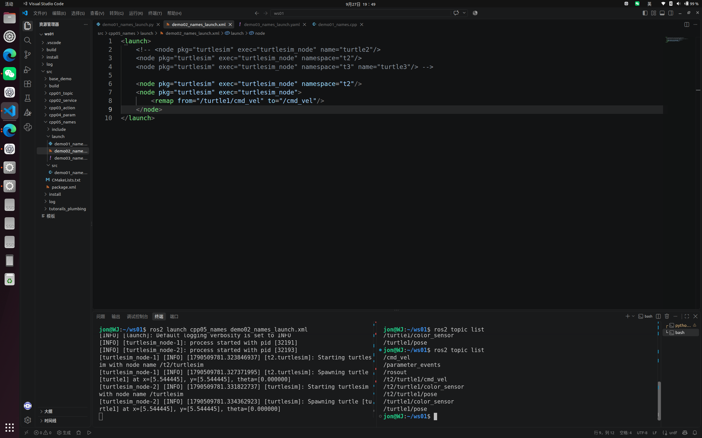

图：XML Launch 实现话题重映射

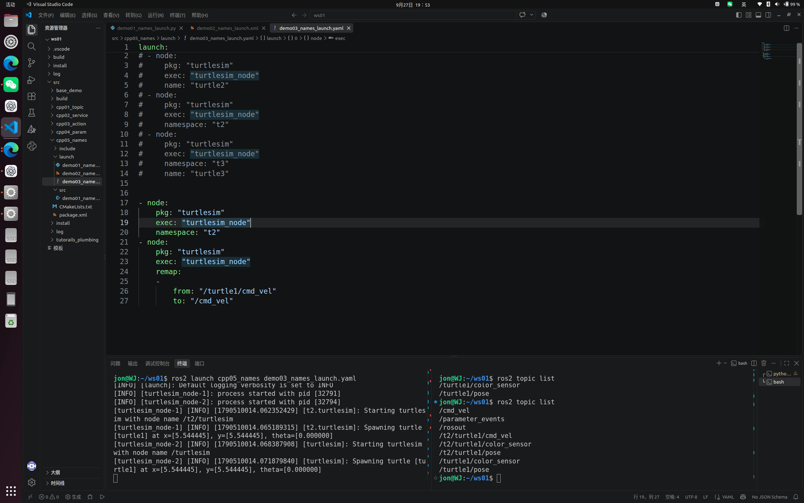

图：YAML Launch 实现话题重映射

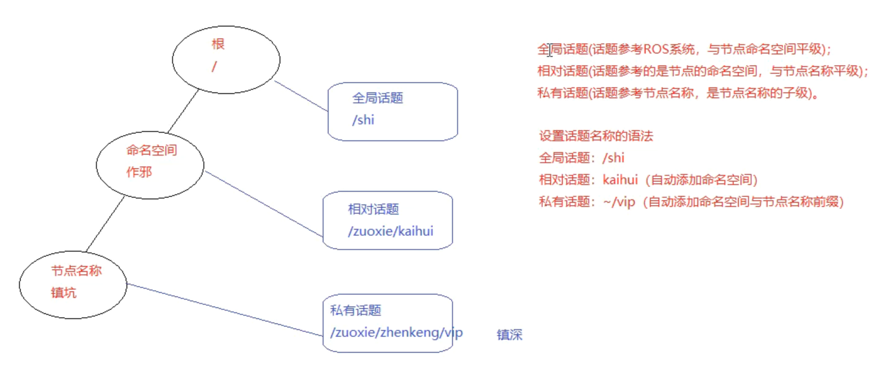

图：全局、相对和私有话题的名称规则

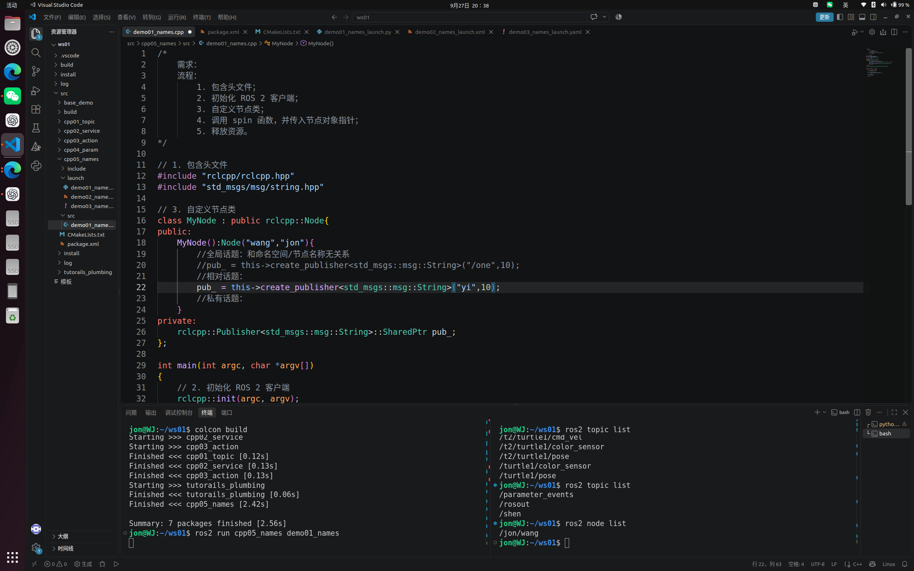

图：C++ 相对话题示例

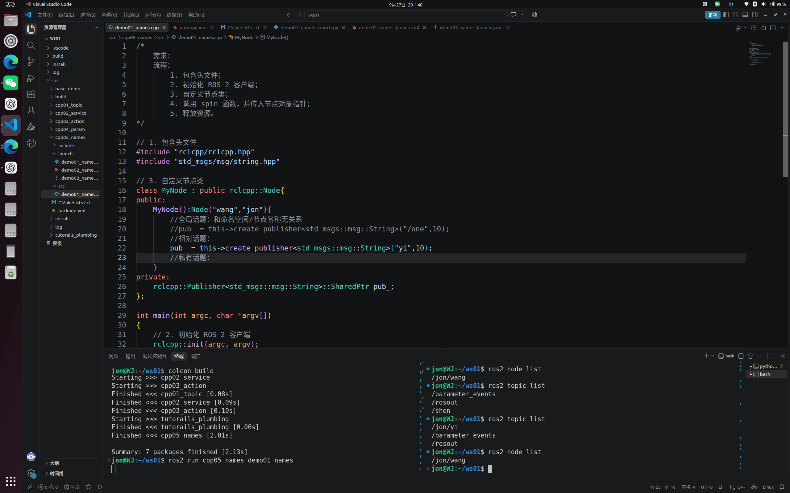

图：C++ 全局话题示例

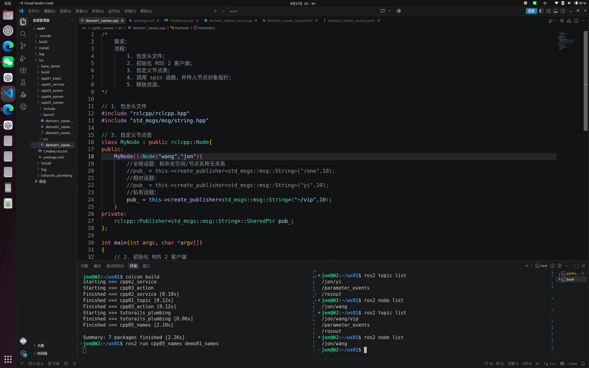

图：C++ 私有话题示例

**学习资料：**

1. [【ROS2理论与实践】第 148 集：话题重名问题与解决方案](https://www.bilibili.com/video/BV1VB4y137ys/?p=148)
2. [【ROS2理论与实践】第 149 集：使用 ros2 run 实现话题重映射](https://www.bilibili.com/video/BV1VB4y137ys/?p=149)
3. [【ROS2理论与实践】第 150 集：使用 Python Launch 实现话题重映射](https://www.bilibili.com/video/BV1VB4y137ys/?p=150)
4. [【ROS2理论与实践】第 151 集：全局、相对和私有话题](https://www.bilibili.com/video/BV1VB4y137ys/?p=151)
5. [【ROS2理论与实践】第 152 集：通过编码设置话题名称](https://www.bilibili.com/video/BV1VB4y137ys/?p=152)

## 七、ROS 2 时间相关 API

本机练习文件为 `~/ws01/src/cpp06_time/src/demo01_time.cpp`。构造函数中一次启用一个演示函数，修改后重新编译并运行 `ros2 run cpp06_time demo01_time`。

### 7.1 Rate：控制循环频率

`rclcpp::Rate` 用于按照指定频率休眠。本机代码分别演示了 500 ms 周期和 1 Hz：

```cpp
rclcpp::Rate rate1(500ms);
rclcpp::Rate rate2(1.0);
rate2.sleep();
```

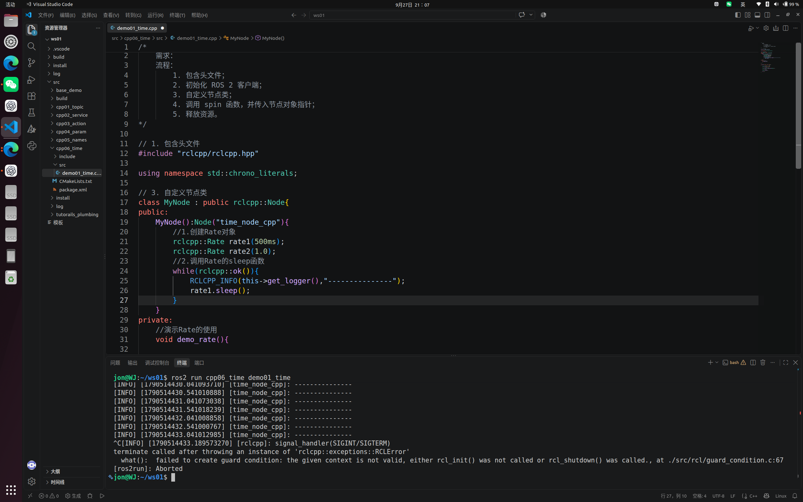

图：使用 Rate 指定休眠时间

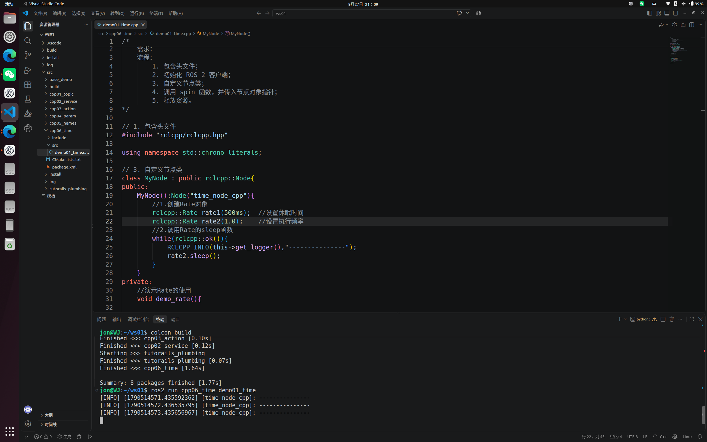

图：使用 Rate 指定运行频率

### 7.2 Time：表示时间点

```cpp
rclcpp::Time t1(500000000L);
rclcpp::Time t2(2, 500000000L);
rclcpp::Time now = this->now();
RCLCPP_INFO(get_logger(), "now = %.2f", now.seconds());
```

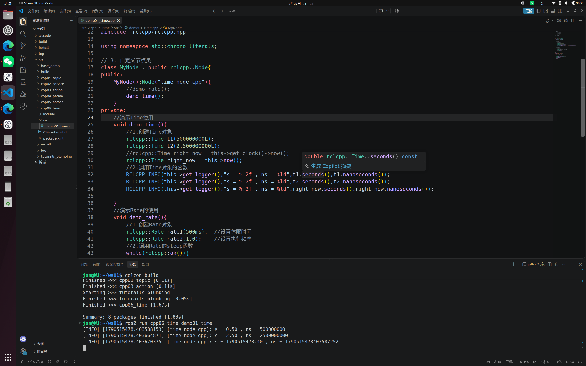

图：Time API 运行演示

### 7.3 Duration：表示时间间隔

```cpp
rclcpp::Duration du1(1, 0);
rclcpp::Duration du2(2, 500000000L);
```

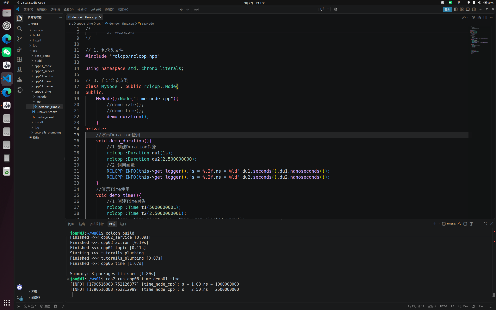

图：Duration API 运行演示

### 7.4 Time 与 Duration 运算

+ `Time - Time = Duration`；
+ `Time + Duration = Time`；
+ `Time - Duration = Time`；
+ 相同类型之间可以进行大小比较。

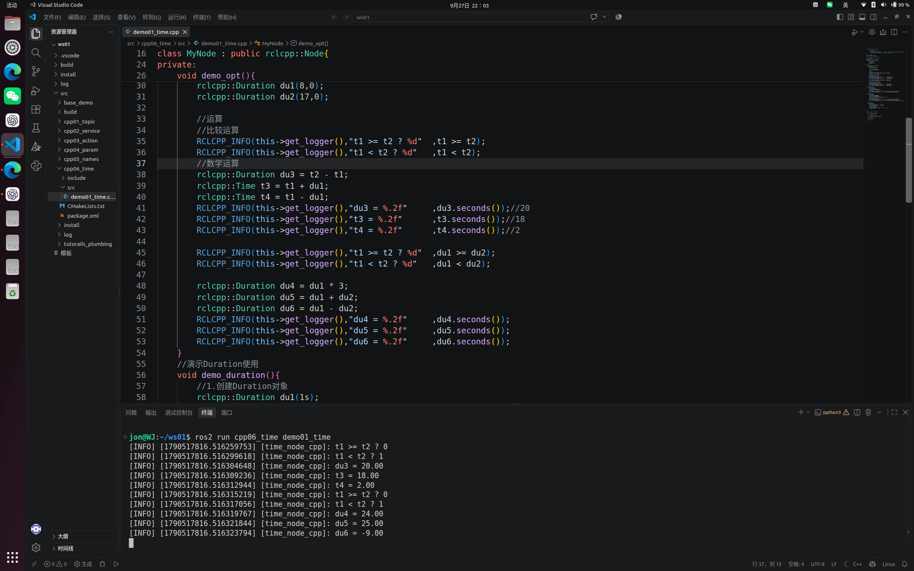

图：Time 与 Duration 运算演示

**学习资料：**

1. [【ROS2理论与实践】第 153 集：时间相关 API 概述](https://www.bilibili.com/video/BV1VB4y137ys/?p=153)
2. [【ROS2理论与实践】第 154 集：Rate 使用](https://www.bilibili.com/video/BV1VB4y137ys/?p=154)
3. [【ROS2理论与实践】第 155 集：Time 使用](https://www.bilibili.com/video/BV1VB4y137ys/?p=155)
4. [【ROS2理论与实践】第 156 集：Duration 使用](https://www.bilibili.com/video/BV1VB4y137ys/?p=156)
5. [【ROS2理论与实践】第 157 集：Time 与 Duration 运算](https://www.bilibili.com/video/BV1VB4y137ys/?p=157)

## 八、ROS 2 常用命令

ROS 2 命令行可以在不修改代码的情况下检查节点、接口、话题、服务、动作和参数，是排查通信问题的第一工具。

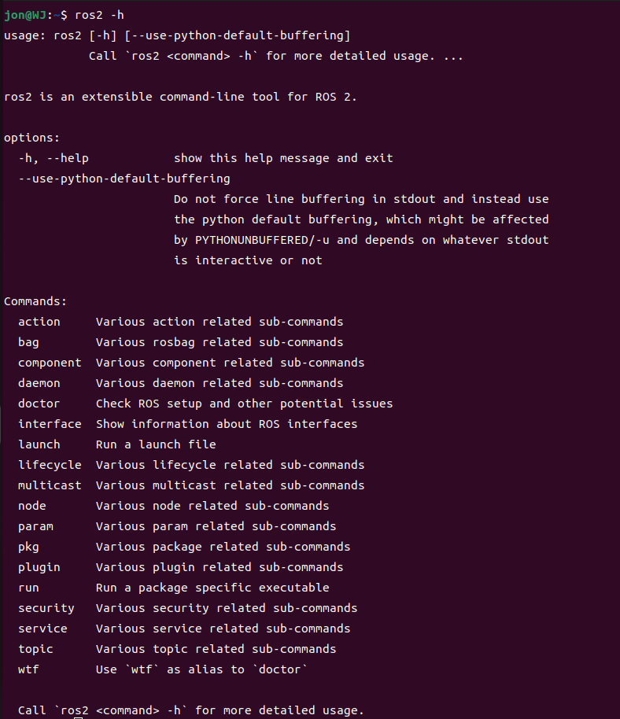

图：Linux 与 ROS 2 常用帮助命令

### 8.1 节点与接口

```bash
ros2 node list
ros2 node info /节点名称
ros2 interface list
ros2 interface show base_demo/msg/Student
ros2 interface show base_demo/srv/Addints
ros2 interface show base_demo/action/Progress
ros2 interface show base_demo/srv/Distance
ros2 interface show base_demo/action/Nav
```

### 8.2 话题

```bash
ros2 topic list
ros2 topic type /student
ros2 topic info /student
ros2 topic echo /student
ros2 topic hz /student
ros2 topic pub /student base_demo/msg/Student "{name: jon, age: 18, height: 1.75}"
```

### 8.3 服务

本机接口文件名和类型名是 `Addints`（不是 AddInts），服务名称为 `/addints`：

```bash
ros2 service list
ros2 service type /addints
ros2 service call /addints base_demo/srv/Addints "{num1: 10, num2: 40}"
```

### 8.4 动作

基础动作练习使用 `base_demo/action/Progress`，动作名称为 `/get_sum`：

```bash
ros2 action list
ros2 action info /get_sum
ros2 action send_goal /get_sum base_demo/action/Progress "{num: 10}" --feedback
```

目标值为 10 时，正确累加结果应为 55。综合导航练习还使用 `base_demo/action/Nav`。

### 8.5 参数

```bash
ros2 param list
ros2 param get /param_server_node_cpp car_name
ros2 param set /param_server_node_cpp width 2.0
ros2 param dump /param_server_node_cpp
ros2 param delete /param_server_node_cpp height
```

**学习资料：**

1. [【ROS2理论与实践】第 158 集：通信机制工具概述](https://www.bilibili.com/video/BV1VB4y137ys/?p=158)
2. [【ROS2理论与实践】第 159 集：ROS 2 命令工具简介](https://www.bilibili.com/video/BV1VB4y137ys/?p=159)
3. [【ROS2理论与实践】第 160 集：ros2 node 命令](https://www.bilibili.com/video/BV1VB4y137ys/?p=160)
4. [【ROS2理论与实践】第 161 集：ros2 interface 命令](https://www.bilibili.com/video/BV1VB4y137ys/?p=161)
5. [【ROS2理论与实践】第 162 集：ros2 topic 命令](https://www.bilibili.com/video/BV1VB4y137ys/?p=162)
6. [【ROS2理论与实践】第 163 集：ros2 service 命令](https://www.bilibili.com/video/BV1VB4y137ys/?p=163)
7. [【ROS2理论与实践】第 164 集：ros2 action 命令](https://www.bilibili.com/video/BV1VB4y137ys/?p=164)
8. [【ROS2理论与实践】第 165 集：ros2 param 命令](https://www.bilibili.com/video/BV1VB4y137ys/?p=165)

## 九、rqt 图形化调试工具

rqt 是 ROS 2 的图形化调试工具箱。它可以查看节点和话题连接、监视话题数据、调用服务、修改参数和集中查看日志。

```bash
rqt
rqt_graph
```

`rqt_graph` 特别适合检查节点是否启动、发布者与订阅者是否连接、话题名称是否一致以及重映射是否正确。命令行适合精确检查，rqt 更适合观察整体通信关系。

**学习资料：**

1. [【ROS2理论与实践】第 166 集：rqt 工具箱](https://www.bilibili.com/video/BV1VB4y137ys/?p=166)

## 十、turtlesim 综合通信练习

综合练习功能包为 `cpp07_exercise`，接口来自 `base_demo`，并配合本地 `turtlesim` 源码进行观察和调试。

### 10.1 话题通信：控制第二只乌龟

`exer01_pub_sub` 订阅 `/turtle1/pose`，根据第一只乌龟的位置生成速度指令，并向 `/t2/turtle1/cmd_vel` 发布 `geometry_msgs/msg/Twist`。

```bash
ros2 launch cpp07_exercise exer01_pub_sub_launch.py
```

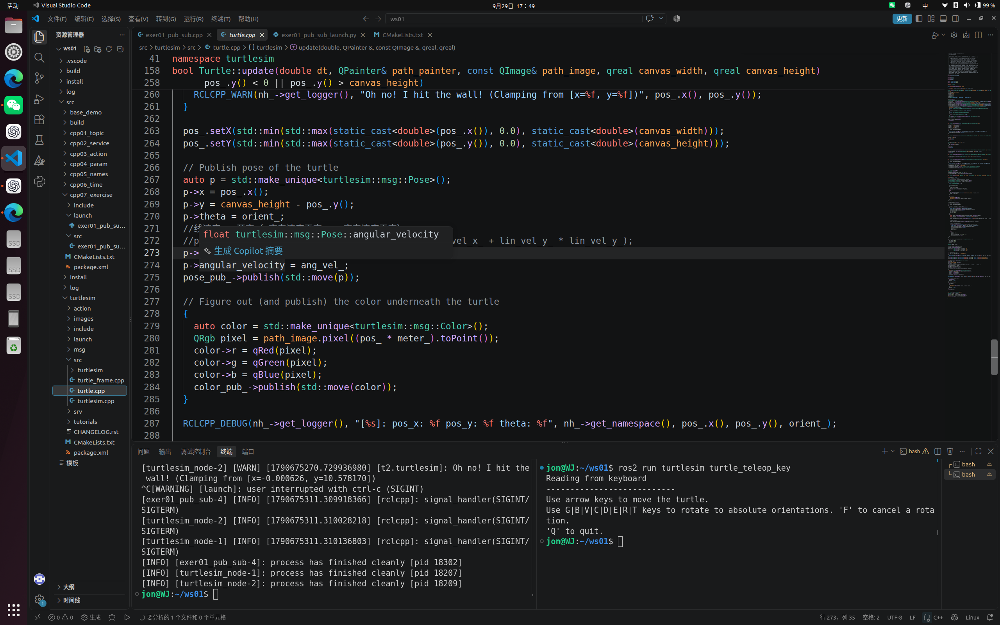

图：下载并查看 turtlesim 源码

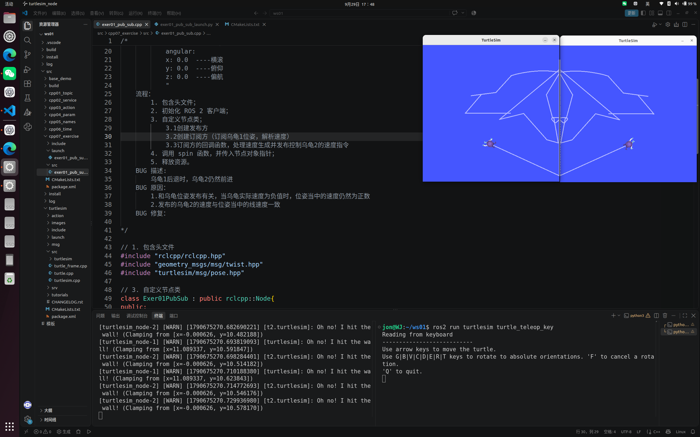

图：话题通信案例运行效果

### 10.2 服务通信：计算两只乌龟的距离

`Distance.srv` 的请求包含目标乌龟的 `x`、`y`、`theta`，响应为 `distance`。`exer02_server` 提供 `/distance` 服务，`exer03_client` 发送目标位置。

```bash
ros2 launch cpp07_exercise exer02_server_launch.py
ros2 launch cpp07_exercise exer03_client_launch.py
```

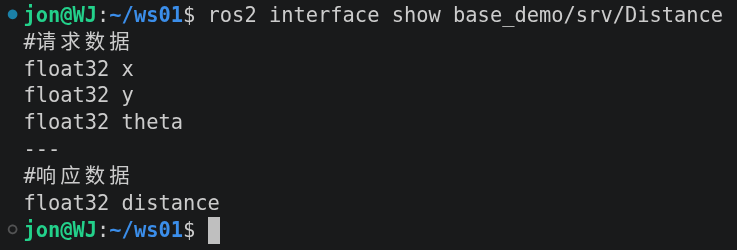

图：创建 Distance 服务接口

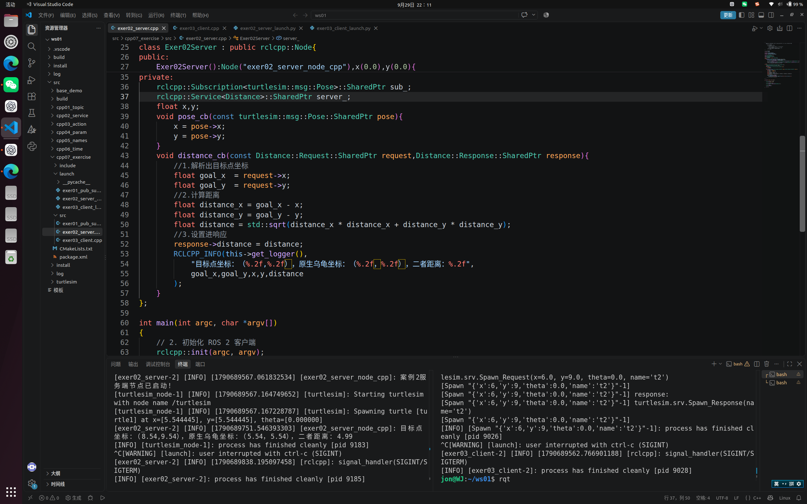

图：检查距离服务端

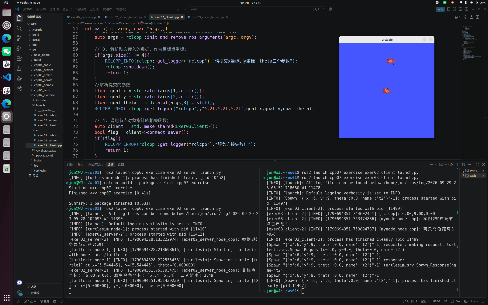

图：距离服务案例演示一

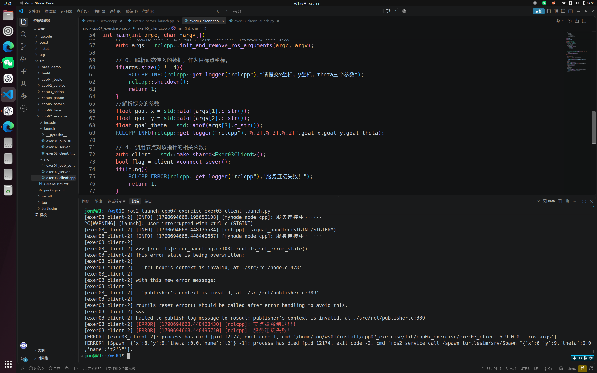

图：距离服务案例演示二

### 10.3 动作通信：导航到目标位置

`Nav.action` 的 Goal 为目标位姿，Result 为最终位姿，Feedback 为剩余距离。`exer04_action_server` 订阅 `/turtle1/pose`、发布 `/turtle1/cmd_vel` 并提供 `/nav` 动作；`exer05_action_client` 负责发送目标和显示反馈。

```bash
ros2 launch cpp07_exercise exer04_server_launch.py
ros2 launch cpp07_exercise exer05_client_launch.py
```

如果“剩余距离”一直显示 0，应检查服务端是否在发布真实距离、客户端反馈回调是否读取了 `feedback->distance`，以及客户端是否在 turtlesim 完成生成并收到位姿后再发送目标。

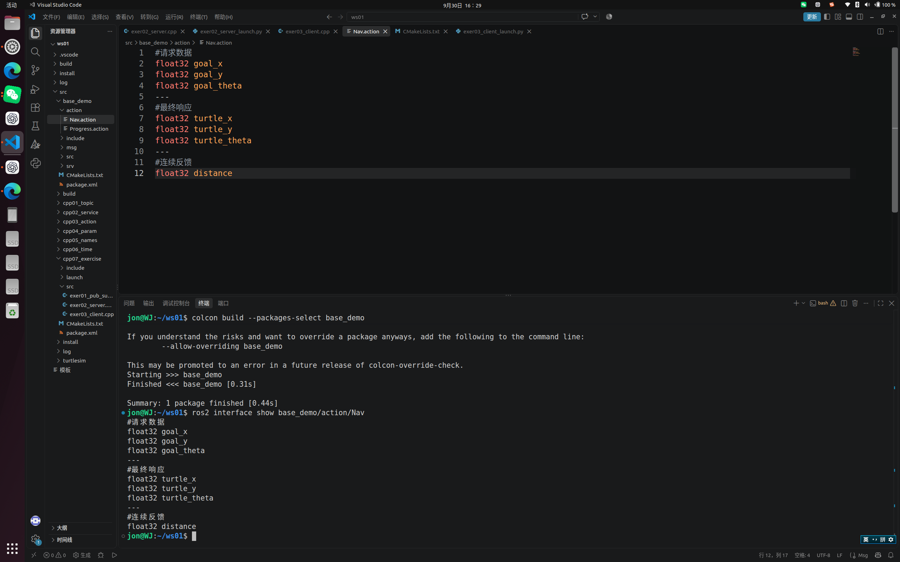

图：创建 Nav 动作接口

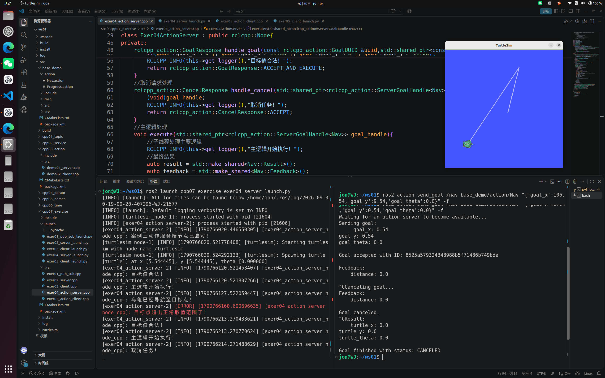

图：检查动作服务端

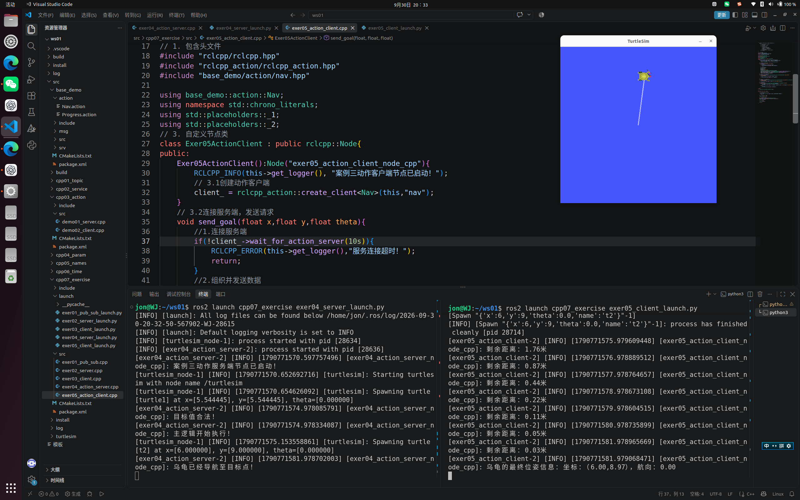

图：动作通信案例运行效果

### 10.4 参数通信：修改背景颜色

`exer06_param` 使用参数客户端读取 turtlesim 的 `background_r`，再按程序逻辑修改颜色参数。运行时必须先启动 turtlesim 参数服务对应的节点。

```bash
ros2 launch cpp07_exercise exer06_param_launch.py
```

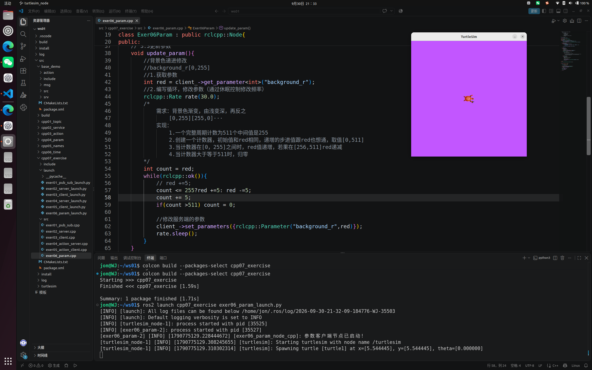

图：参数服务综合案例

## 十一、实际排错记录

### 11.1 功能包或可执行程序找不到

先确认包已经编译，再加载正确的工作空间环境：

```bash
cd ~/ws01
colcon build --packages-select 功能包名
source /opt/ros/humble/setup.bash
source ~/ws01/install/setup.bash
ros2 pkg executables 功能包名
```

本机已经在 `~/.bashrc` 中配置 ROS 2 和 `~/ws01` 环境时，新终端通常无需再次手动 source；但刚完成编译的当前终端仍建议重新加载一次。

### 11.2 VS Code 找不到头文件或 compile_commands 条目

在工作空间根目录重新生成编译数据库，并确保 VS Code 打开的是 `~/ws01`：

```bash
cd ~/ws01
colcon build --cmake-args -DCMAKE_EXPORT_COMPILE_COMMANDS=ON
```

还要确认源文件已经在对应功能包的 `CMakeLists.txt` 中通过 `add_executable` 注册，并且依赖已写入 `ament_target_dependencies`。仅创建源文件但未加入构建目标时，VS Code 无法在编译数据库中找到它。

### 11.3 Launch 文件或节点未按预期运行

1. 确认 Launch 目录已安装到 `share/${PROJECT_NAME}`；
2. 确认 `package.xml` 包含 `ros2launch` 运行依赖；
3. 重新编译并加载 `~/ws01/install/setup.bash`；
4. 使用 `ros2 node list`、`ros2 topic list` 和 `rqt_graph` 检查实际名称；
5. 发布者、订阅者或动作客户端与服务端的名称必须一致。

### 11.4 当前工程中的命名细节

+ 参数服务端源文件当前名为 `demo01_sever.cpp`，其中 `sever` 是历史拼写；运行和编译时应以 CMakeLists.txt 中注册的目标名为准。
+ 自定义服务类型当前写作 `base_demo/srv/Addints`，大小写必须完全一致。
+ 元功能包当前写作 `tutorails_plumbing`，命令中不要自动改成其他拼写。
+ `~/ws01/src` 下残留的 `build/install/log` 是曾在错误目录编译产生的历史目录；以后统一在 `~/ws01` 编译。

## 十二、总结

本阶段完成了 ROS 2 分布式通信、工作空间覆盖、元功能包、节点和话题名称管理、时间 API、命令行工具与 rqt 的学习，并在 `~/ws01` 中通过 `cpp05_names`、`cpp06_time` 和 `cpp07_exercise` 完成了对应实践。

现在已经能够从网络与域 ID、工作空间环境、节点和话题名称、接口类型、构建配置五个方向排查通信问题；也能够使用 Python、XML、YAML Launch 管理 C++ 节点，并通过 turtlesim 综合验证话题、服务、动作和参数通信。

**学习资料：**

1. [【ROS2理论与实践】第 197 集：第三章总结](https://www.bilibili.com/video/BV1VB4y137ys/?p=197)

完整学习资料：[ROS2 Tuition 第三章：ROS 2 通信机制补充](https://rzl6.github.io/ROS2_Tuition/di-3-zhang-ros2-tong-xin-ji-zhi-bu-chong/31-fen-bu-shi.html)
