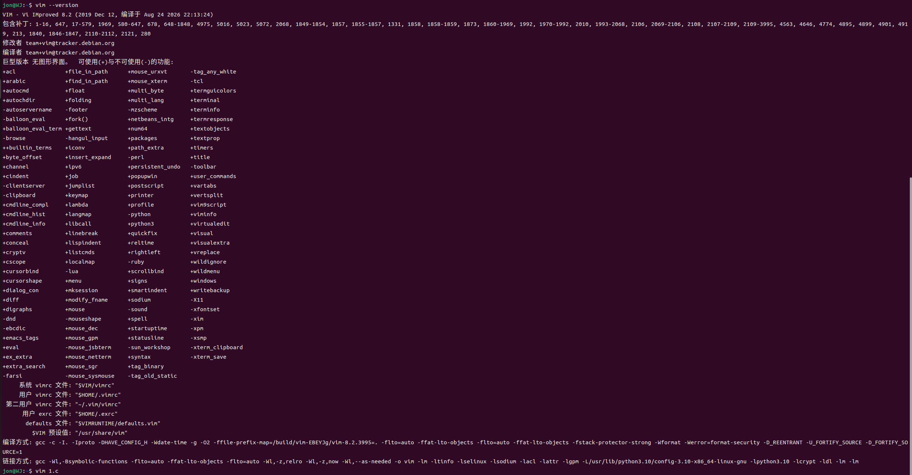
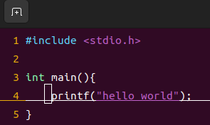
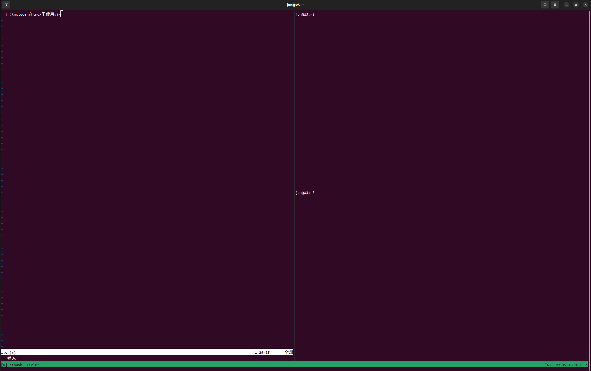

# Vim、tmux、SSH 与 PM2 开发工具学习

Vim、tmux 和 SSH 是 Linux 远程开发与项目调试中的常用工具。SSH 负责连接远程设备，tmux 负责管理和保留终端会话，Vim 负责直接在终端中编辑文件。三者配合后，即使没有图形界面或 VS Code 无法正常连接，也可以继续完成程序调试和维护。

## 一、Vim 终端编辑器

Vim 是一种可以直接在终端中使用的文本编辑器，适合编辑代码、配置文件和启动脚本。即使图形界面或 VS Code 无法正常使用，也可以通过终端快速修改文件。

安装并检查 Vim：

```bash
sudo apt install vim
vim --version
```



Vim 主要包含三种工作模式：

1. 普通模式：用于移动光标、复制、删除和撤销。
2. 插入模式：用于输入和修改文字。
3. 命令行模式：用于保存、退出、搜索和替换。

| 操作 | 作用 |
| --- | --- |
| `vim 文件名` | 使用 Vim 打开文件 |
| `i` | 进入插入模式 |
| `Esc` | 返回普通模式 |
| `dd` | 删除当前行 |
| `yy` | 复制当前行 |
| `p` | 粘贴 |
| `u` | 撤销 |
| `/关键词` | 搜索内容 |
| `:w` | 保存文件 |
| `:q` | 退出 Vim |
| `:wq` | 保存并退出 |
| `:q!` | 放弃修改并强制退出 |




利用hello world程序掌握vim基础语法，后续还需练习。

学习资料：[【保姆级入门】Vim编辑器](https://www.bilibili.com/video/BV13t4y1t7Wg/)

## 二、tmux 终端会话管理

tmux 是一个终端会话管理工具，可以在一个终端中创建多个窗口和分屏，还可以在 SSH 连接断开后保留程序的运行状态。

安装并检查 tmux：

```bash
sudo apt install tmux
tmux -V
```

常用命令如下：

```bash
tmux new -s robot-debug
tmux ls
tmux attach -t robot-debug
tmux kill-session -t robot-debug
```

tmux 的快捷键需要先按 `Ctrl+b`，松开后再按后续按键：

| 快捷键 | 作用 |
| --- | --- |
| `Ctrl+b`，再按 `d` | 暂时离开当前会话 |
| `Ctrl+b`，再按 `%` | 左右分屏 |
| `Ctrl+b`，再按 `"` | 上下分屏 |
| `Ctrl+b`，再按方向键 | 切换窗格 |
| `Ctrl+b`，再按 `c` | 创建新窗口 |
| `Ctrl+b`，再按 `n` | 切换到下一个窗口 |
| `Ctrl+b`，再按 `[` | 进入滚动模式，按 `q` 退出 |


在tmux中调用vim：



在项目调试中，可以在一个窗格中使用 Vim 修改配置，在另一个窗格中编译和运行程序，再使用其他窗格查看日志。即使网络中断，重新建立 SSH 连接后也可以恢复原来的调试会话。

学习资料：[tmux 使用和基础配置：从入门到加班，一个视频全搞定！](https://www.bilibili.com/video/BV1Pnche9EwY/)

## 三、SSH 远程连接

SSH 是一种加密的远程连接协议，可以通过网络登录并操作另一台电脑。在 RoboMaster 项目中，可以使用网线连接个人电脑和机器人小电脑，让两台设备处于同一网段，再使用 SSH 进行远程调试。

例如，可以将个人电脑和机器人小电脑设置为：

| 设备 | 示例 IP 地址 | 子网掩码 |
| --- | --- | --- |
| 个人电脑 | `192.168.10.1` | `255.255.255.0` |
| 机器人小电脑 | `192.168.10.2` | `255.255.255.0` |


实际地址应以实验室配置为准，并避免产生 IP 冲突。连接前先测试网络：

```bash
ping 192.168.10.2
```

确认能够通信后，通过 SSH 登录：

```bash
ssh 用户名@192.168.10.2
```

连接成功后，本机终端中输入的命令实际在机器人小电脑上执行。可以使用以下命令确认当前设备和用户：

```bash
hostname
whoami
pwd
ip addr
```

SSH 本身不依赖 VS Code。连接成功后，可以直接启动程序、查看日志、使用 Vim 修改文件，并通过 tmux 保留调试会话。日常修改大量代码或 YAML 参数时，可以使用 VS Code Remote SSH 获得语法高亮、目录浏览、搜索和格式提示；当 VS Code 无法加载时，SSH、Vim 和 tmux 可以作为可靠的备用方案。

学习资料：[SSH 连接 Ubuntu 服务器](https://www.bilibili.com/video/BV1f926BhEf2/)

## 四、PM2 进程管理

PM2 是一个进程管理工具，可以让程序在后台持续运行，并提供状态查看、日志记录和异常重启等功能。即使关闭终端或 SSH 连接中断，由 PM2 管理的程序仍然可以继续运行。

本机安装的是兼容当前 Node.js 环境的 PM2 5.4.3：

```bash
npm install -g --prefix ~/.local pm2@5.4.3
pm2 --version
```

启动并命名一个程序：

```bash
pm2 start app.js --name my-app
```

常用命令如下：

| 命令 | 作用 |
| --- | --- |
| `pm2 list` | 查看进程列表 |
| `pm2 logs my-app` | 查看程序日志 |
| `pm2 restart my-app` | 重启程序 |
| `pm2 stop my-app` | 停止程序 |
| `pm2 delete my-app` | 删除进程记录 |
| `pm2 monit` | 查看资源占用 |
| `pm2 save` | 保存当前进程列表 |


PM2 适合管理需要长期运行的程序。如果只是进行临时编译或调试，可以直接在 tmux 中运行，不一定需要使用 PM2。

## 五、工具总结

| 工具 | 主要作用 | 典型场景 |
| --- | --- | --- |
| SSH | 连接并控制远程设备 | 登录机器人小电脑、执行命令 |
| tmux | 管理并保留终端会话 | 分屏调试、运行临时任务 |
| Vim | 在终端中编辑文件 | 修改代码、配置和启动脚本 |
| PM2 | 管理后台程序和日志 | 运行需要长期保持的程序 |


这四种工具可以配合使用：先通过 SSH 登录远程设备，使用 tmux 创建可恢复的终端会话，通过 Vim 修改代码和配置，最后根据需要使用 PM2 管理需要长期运行的程序。
